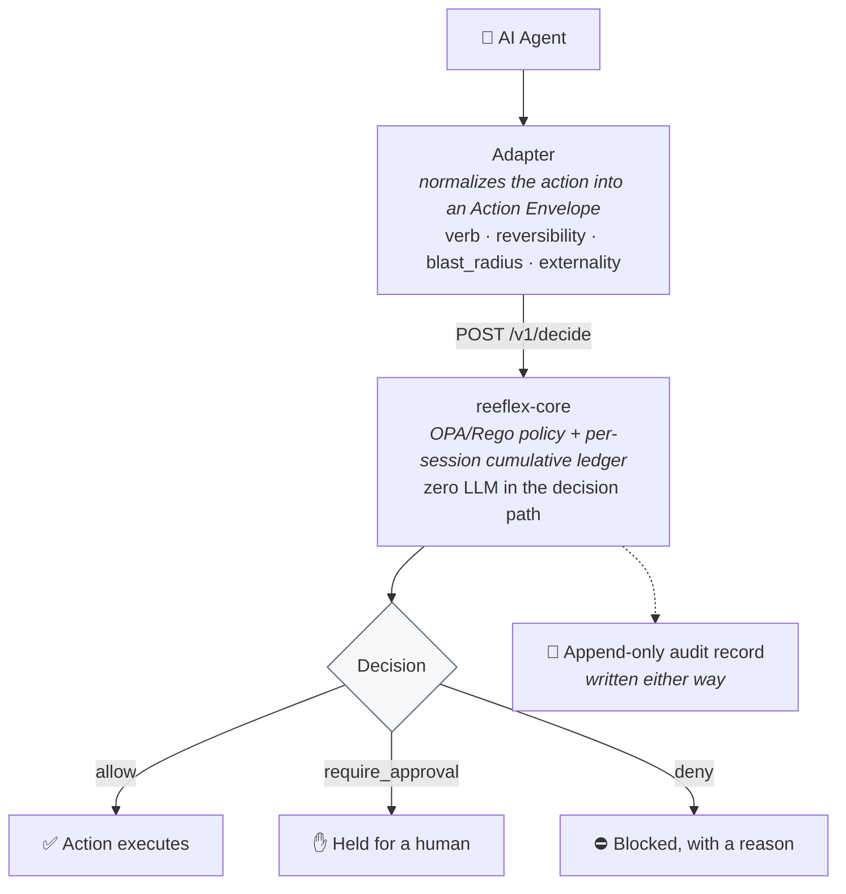

<div align="center">

# Reeflex

**A seatbelt for the AI acting on your systems.**

Reeflex is a deterministic gate that decides — *before* an AI agent's action
reaches your data — whether it is safe to run, needs a human, or must be
blocked. Across any backend, with no LLM in the decision path.

[](LICENSE)
[](CHANGELOG.md)
[](#status--v01-preview)
[](https://github.com/Reeflex-io/reeflex/actions/workflows/ci.yml)
[](reeflex-wordpress/)
[](https://github.com/Reeflex-io/reeflex/releases)

[Why Reeflex](docs/why-reeflex.md) · [Quickstart](QUICKSTART.md) · [How it works](#how-it-works) ·
[WordPress adapter](reeflex-wordpress/) · [Claude Code adapter](reeflex-claude/) ·
[Spec](reeflex-spec/SPEC.md) · [Whitepaper](docs/Reeflex_Architecture.pdf) ·
[Contributing](CONTRIBUTING.md)

</div>

---

## What is Reeflex?

AI agents can now write to your database, edit your store, send your emails.
That capability is racing ahead — the safety layer underneath it has not kept
pace. One wrong action can be irreversible: a hard delete, an executed payment,
a mass email.

Reeflex sits at the boundary between an agent and the system it acts on. Every
write is intercepted, normalized into a universal **Action Envelope**, and
evaluated against a policy that asks a sharper question than "is this user
allowed?" — it asks **"is this action safe, given the impact it would actually
have?"** The answer is one of three decisions:

- **allow** — the action proceeds
- **deny** — it is blocked, with a reason the agent can read
- **require_approval** — it is held until a human confirms

The decision is made by OPA/Rego plus classical logic. Same envelope in, same
decision out, every time. **Zero LLM in the decision path** — because a safety
mechanism should be auditable and reproducible, not a second guess.

### Open source, and meant to stay that way

The engine, the specification, the policy language, and the reference adapters
are all Apache-2.0 — yours to run, fork, and build on, with no lock-in and no
metering on the decision path. Safety infrastructure works best when the people
who depend on it can read every line. The line we hold: **everything that keeps
you safe is free, forever** — a planned commercial tier adds compliance
*attestation* (auditor-ready reports, regulation-mapped policy packs, a hosted
engine), never safety. Details in [docs/open-core.md](docs/open-core.md).

The open tier is already useful as an evidence source: every decision lands in
an append-only audit log —
a pre-execution record of what an agent *attempted*, not just what happened.
If you have ever had to answer an auditor's "what could this agent have done,
and what stopped it?", that log is the answer.

### Modular by design — and complementary, not a replacement

Reeflex is a small core with a documented contract and adapters around it. It is
deliberately **not** a monolith, and it does **not** try to replace the agent-
governance platforms you may already run:

- **Microsoft Agent Governance / Entra Agent ID**, **AWS Bedrock Guardrails**,
  **Google Vertex**, and identity-authorization engines like **OPA**,
  **Cerbos**, and **Permit.io** govern at the **source**: who the agent is, what
  role it holds, what it is permitted to call.
- **Reeflex** governs at the **resource**, on **computed impact**: given this
  exact action and everything already done this session, is it safe to let it
  through? An identity that is fully authorized can still be about to do
  something irreversible and broad — that is the case Reeflex is built for.

The two are layers, not competitors. Source-side governance decides *who may
act*; Reeflex decides *whether this specific act is safe*. Run both and you have
identity **and** impact covered.

The contract is deliberately simple and fully public — designed so that anyone
can build on it. If you want Reeflex in front of a system we haven't built an
adapter for yet — a database, a message queue, an internal API — the
[SPEC](reeflex-spec/SPEC.md) is all you need. Four responsibilities, one
envelope shape, and **new adapters and policy packs from the community are
genuinely welcome — we'll help you land them**. See
[CONTRIBUTING.md](CONTRIBUTING.md).

---

## How it works



The adapter enforces the decision faithfully and **fails closed** — if the
engine is unreachable, nothing goes through.

**Observe mode** — run in dry-run first: every verdict is recorded, nothing enforced, so you can see what Reeflex would have stopped before turning it on. (WordPress: `REEFLEX_MODE=observe` constant or the Settings dropdown. Claude adapter: `REEFLEX_MODE=observe` env var. In observe a core outage fails OPEN — never blocks.)

Decisions are also **cumulative per session**: an agent that splits
"delete 500" into a hundred small batches trips the same budget as the single
big call. Each batch looks innocent on its own; the session total doesn't —
so fragmenting a dangerous action doesn't evade the gate.
([How impact is computed →](reeflex-spec/IMPACT-MODEL.md))

The whole base policy is **five rules you can read in one minute** — each a
decades-old safety principle applied to agent actions, with its limits
[documented honestly](reeflex-spec/IMPACT-MODEL.md#what-the-base-policy-does-not-catch).
Universal axes, readable rules, yours to extend.

The engine knows nothing about WordPress, Postgres, or S3. It decides on
**actions** — normalized, structured, and risk-profiled. Adapters are the
ecosystem; the spec and the engine are the product. See the
[architecture whitepaper (PDF)](docs/Reeflex_Architecture.pdf) for the full
picture, or [SPEC.md](reeflex-spec/SPEC.md) for the contract.

---

## Deploy on-prem in one command

Everything runs inside your own infrastructure. No decision data ever leaves
your network.

```bash
git clone https://github.com/Reeflex-io/reeflex.git
cd reeflex
docker compose up -d          # builds and starts reeflex-core on :8080
```

Verify it's live:

```bash
curl http://localhost:8080/healthz
# {"status":"ok"}
```

> **No clone needed?** Pull the prebuilt image straight from GHCR:
>
> ```bash
> docker run -d -p 8080:8080 ghcr.io/reeflex-io/reeflex-core:latest
> curl http://localhost:8080/healthz   # {"status":"ok"}
> ```
>
> `:latest` tracks the newest published image. To pin an explicit version
> instead — e.g. `:v0.1.5` at the time of writing — check the
> [Releases page](https://github.com/Reeflex-io/reeflex/releases) for the
> current tag.

That's the whole engine — stateless, self-contained, fail-closed. Put it behind
your reverse proxy for TLS, point your adapter at it, and you're governing
actions. For a hardened setup (auth token, body-size caps, non-root container),
see [INSTALL.md](INSTALL.md).

> Prefer to run without Docker? [INSTALL.md](INSTALL.md) covers the direct Python 3.12 and OPA setup.

> **Want to try it without deploying anything?** We run a public development
> endpoint at `https://api-dev.reeflex.io` — point an adapter at it and go. It
> carries a Let's Encrypt *staging* certificate (dev only, not for production),
> so set the adapter's `verify_ssl` option to `false` for this endpoint only.
> Details in the [WordPress adapter guide](reeflex-wordpress/README.md#about-api-devreeflexio-public-development-endpoint).

---

## Usage

An adapter turns a backend action into an Action Envelope and asks core for a
decision. The call is a single `POST` — one direction, no callbacks:

```bash
curl -s http://localhost:8080/v1/decide \
  -H 'content-type: application/json' \
  -d '{
    "action":  { "verb": "delete", "ability": "wordpress/delete-post" },
    "axes":    { "reversibility": "irreversible", "blast_radius": "broad", "externality": "internal" },
    "magnitude": { "count": 50 },
    "target":  { "environment": "production" },
    "agent":   { "session_id": "sess-42" }
  }'
```

```json
{
  "decision": "require_approval",
  "rule": "reeflex.policy/irreversible_broad_prod",
  "reason": "irreversible broad change in production requires human approval"
}
```

The adapter then enforces that decision: proceed, block, or hold for a human.
A worked adapter lives in [`reeflex-mock/`](reeflex-mock/), and two
conformance-tested reference adapters ship in this repo — see below.

---

## Adapters

| Adapter | Boundary | Status |
|---|---|---|
| [`reeflex-mock`](reeflex-mock/) | in-memory reference | worked example + 5-scenario demo |
| [`reeflex-claude`](reeflex-claude/) | Claude Code (source-side) | `pip install reeflex-claude` · conformance-tested · 133 tests |
| [`reeflex-wordpress`](reeflex-wordpress/) | WordPress Abilities API (resource-side) | conformance-tested end-to-end |
| `reeflex-postgres` | database wire-protocol | on the roadmap |
| `reeflex-graphql` | GraphQL resolvers | on the roadmap |

Adapters implement four responsibilities from [SPEC §6](reeflex-spec/SPEC.md):
**intercept → normalize → enforce → audit.** Anyone can write one against the
spec — [CONTRIBUTING.md](CONTRIBUTING.md) walks through it.

---

## Status — v0.1 preview

**Shipping today:**

- `reeflex-core` decision engine (`POST /v1/decide`) — Python + OPA/Rego, **207** unit tests (1 platform-specific skip), **9/9** policy tests
- Base policy pack (R1–R5): read-only allow, irreversible-broad-prod approval, irreversible-systemic-prod deny, default allow, session delete-budget
- Fail-closed on any OPA error or unreachable core — never a silent allow
- Anti-fragmentation: a per-session cumulative ledger defeats split-batch evasion
- Two conformance-tested reference adapters (Claude Code, WordPress)
- **SIEM-ready**: every decision streams as syslog (RFC 5424, JSON or CEF) — Splunk, QRadar, Wazuh, Graylog, Loki and friends consume it with zero vendor connectors. The SOC sees the attempt, not just the aftermath. See [docs/siem.md](docs/siem.md).
- **Human-in-the-loop, operational**: `require_approval` materializes a persistent hold with a resolution API (`/v1/holds`), approval principals (human/agent/automation, human-only by default), `actor != approver` enforced, single-use + TTL + action-hash binding, and a kill-switch. Surfaces: the WordPress "Pending approvals" admin page and the `reeflex-holds` MCP server (approve from Claude Desktop).

**On the roadmap:** ed25519 envelope signing, Postgres-backed audit,
database/GraphQL adapters, Slack/CLI approval surfaces + daily digest,
N-of-M quorum approvals, and a hosted tier. Full list in
[ROADMAP.md](ROADMAP.md).

---

## Learn more

- [Architecture whitepaper (PDF)](docs/Reeflex_Architecture.pdf) — the decision model, how impact is computed, and five real use cases
- [QUICKSTART.md](QUICKSTART.md) — clone to a working "watch it stop a delete" in under 10 minutes
- [SPEC.md](reeflex-spec/SPEC.md) — the Action Envelope and Adapter Contract
- [IMPACT-MODEL.md](reeflex-spec/IMPACT-MODEL.md) — how impact is computed, in depth
- [docs/adr/](docs/adr/) — the decisions behind the design, including [why no LLM in the decision path](docs/adr/0002-no-llm-in-decision-path.md)

---

## Contributing & license

Contributions to the open core are welcome — start with
[CONTRIBUTING.md](CONTRIBUTING.md). Security disclosures go through
[SECURITY.md](SECURITY.md).

Reeflex is licensed under the [Apache License 2.0](LICENSE). The open core —
engine, adapters, spec, and base policy packs — is free forever. A separate
commercial compliance tier (EU/RO regulated reporting) is planned to fund the
work; community contributions target the open core only.

Two components carry a different license **only because their distribution
channel requires it** — we hold the copyright and dual-license; the code is a
thin, IP-free adapter in each case:

| Component | License | Why |
|---|---|---|
| Core, spec, `reeflex-claude`, base policy packs | **Apache-2.0** | the project default |
| `reeflex-wordpress` (the WordPress plugin) | **GPLv2-or-later** | WordPress.org directory requirement |
| `n8n-nodes-reeflex` (the n8n community node) | **MIT** | n8n community-node verification requirement |
