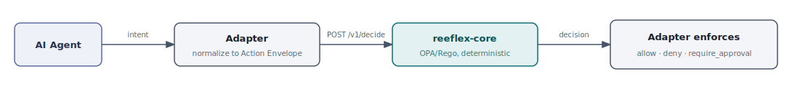
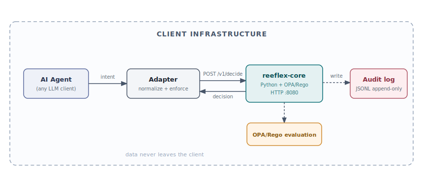

# Reeflex

**Governance that isn't another AI.** A deterministic gate on AI-agent ACTIONS — allow, deny, or require human approval — before any backend action executes.

[](LICENSE)
[](CHANGELOG.md)

---

## The problem

AI agents no longer just read and recommend. They take real, consequential actions: deleting records, deploying infrastructure, sending email, processing payments. The governance layer has not kept pace.

From verified research:

- **Hundreds of public MCP servers are vulnerable to abuse** (arbitrary command execution, plus "NeighborJack" network exposure where servers bind to 0.0.0.0). ([Backslash Security, June 2025](https://www.backslash.security/blog/hundreds-of-mcp-servers-vulnerable-to-abuse))
- A WordPress AI plugin flaw (CVE-2025-11749, AI Engine plugin, 100,000+ sites, CVSS 9.8) **exposed full admin access** via an unauthenticated bearer token on a public REST endpoint, patched in v3.1.4. ([Rapid7 / Wordfence, Oct 2025](https://www.rapid7.com/db/vulnerabilities/ai-engine-plugin-cve-2025-11749/))
- **72% of executives say their org has integrated and scaled AI, but only about a third have proper governance protocols.** ([EY Responsible AI Pulse, 2025](https://www.ey.com/en_gl/newsroom/2025/06/ey-survey-ai-adoption-outpaces-governance-as-risk-awareness-among-the-c-suite-remains-low))

Enterprise MCP-security products exist. They cost thousands per month and none of them target WordPress or the SMB segment. That gap is what Reeflex fills.

---

## What Reeflex does

Reeflex sits at the action boundary between an AI agent and any backend. An **adapter** normalizes the backend-specific operation into a universal **Action Envelope** (three axes: reversibility, blast_radius, externality). The **reeflex-core** engine evaluates that envelope against OPA/Rego policy and returns one of three deterministic decisions:

- `allow` — the action proceeds
- `deny` — the action is blocked; the reason surfaces to the agent
- `require_approval` — the action is held pending explicit human confirmation

Zero LLM in the decision path. Same envelope in, same decision out — every time.

```
AI Agent
   |
   v
Adapter (normalize to Action Envelope)
   |  POST /v1/decide { ActionEnvelope }
   v
reeflex-core
   +-- OPA/Rego policy evaluation
   +-- per-session cumulative ledger (fragmentation resistance)
   |
   v
Decision { allow | deny | require_approval }
   |
   v
Adapter enforces (proceed / block / hold-for-approval)
```

The engine knows nothing about WordPress, Postgres, or S3. It decides on **actions**, normalized, structured, and risk-profiled. Adapters are the ecosystem; the spec and the engine are the product. See [`reeflex-spec/SPEC.md`](reeflex-spec/SPEC.md) for the full contract.

---

## Decision flow



*AI Agent -> Adapter (normalize to Action Envelope) -> reeflex-core /v1/decide (OPA/Rego) -> allow | deny | require_approval -> Adapter enforces*

---

## Deployment — Variant A (on-prem, shipping now)

All components run inside your own infrastructure. Decision data never leaves.



*All components — AI Agent, Adapter, reeflex-core, OPA evaluation, and Audit log — run inside the client boundary. Data never leaves the client.*

A hosted variant (Variant B) where the adapter calls a Reeflex-operated engine over HTTPS is planned but does not exist yet. See [`docs/architecture.md`](docs/architecture.md) and [`docs/adr/0001-deployment-model.md`](docs/adr/0001-deployment-model.md).

---

## Reeflex in action

Run the demo yourself (requires Python 3.12 and an OPA 1.x binary — see [INSTALL.md](INSTALL.md)):

```bash
# Point REEFLEX_OPA_BIN at your opa binary (or just "opa" if it is on your PATH)
# Windows (cmd)
set REEFLEX_OPA_BIN=opa
set REEFLEX_POLICY_DIR=reeflex-core\policy

# Linux / macOS
export REEFLEX_OPA_BIN=opa
export REEFLEX_POLICY_DIR=reeflex-core/policy

python reeflex-mock/demo.py
```

Real captured output (trimmed — full run is ~120 lines):

```
REEFLEX MOCK ADAPTER -- END-TO-END DEMO
  OPA binary  : opa
  Policy dir  : reeflex-core/policy
  Core port   : 8181

========================================================================
SCENARIO 1: Read benign post -> ALLOW (store unchanged)
========================================================================
VERDICT:
  decision  : allow
  rule      : reeflex.policy/read_only_internal
  reason    : read-only internal action
STORE BEFORE->AFTER:
  before: 100 posts  ids=[1, 2, 3, 4, 5, 6, 7, 8, 9, 10] ... +90
  after : 100 posts  ids=[1, 2, 3, 4, 5, 6, 7, 8, 9, 10] ... +90
  ASSERT [PASS] decision == allow
  ASSERT [PASS] store count unchanged after read

========================================================================
SCENARIO 2: Delete 1 post (recoverable/single) -> ALLOW (post actually gone)
========================================================================
VERDICT:
  decision  : allow
  rule      : reeflex.policy/default_allow
  reason    : no high-risk axis matched
STORE BEFORE->AFTER:
  post 42 existed before: True
  post 42 exists  after:  False
  after : 99 posts  ...
  ASSERT [PASS] decision == allow
  ASSERT [PASS] post gone after delete (read-back)

========================================================================
SCENARIO 3: Bulk delete 50 posts in production -> REQUIRE_APPROVAL (store UNTOUCHED)
========================================================================
VERDICT:
  decision  : require_approval
  rule      : reeflex.policy/irreversible_broad_prod
  reason    : irreversible broad change in production requires human approval
STORE BEFORE->AFTER:
  before: 99 posts  ids=[1, 2, 3, 4, 5, 6, 7, 8, 9, 10] ... +89
  after : 99 posts  ids=[1, 2, 3, 4, 5, 6, 7, 8, 9, 10] ... +89
  ASSERT [PASS] decision == require_approval
  ASSERT [PASS] store count UNCHANGED (read-back)

========================================================================
SCENARIO 4: Fragmentation: repeated delete batches -> REQUIRE_APPROVAL at budget boundary
========================================================================
  Batch 1: ids=[1,2,3,4,5]   decision=allow      cumulative_before=0
  Batch 2: ids=[6,7,8,9,10]  decision=allow      cumulative_before=5
  Batch 3: ids=[11..15]      decision=allow      cumulative_before=10
  Batch 4: ids=[16..20]      decision=allow      cumulative_before=15
  Batch 5: ids=[21..25]      decision=require_approval  rule=reeflex.policy/session_delete_budget
  --> Budget crossed at batch 5 (cumulative before = 20, batch size = 5)
  ASSERT [PASS] exactly 1 REQUIRE_APPROVAL (crossing batch)
  ASSERT [PASS] crossing batch NOT executed (store_changed=False)

========================================================================
SCENARIO 5: Fail-closed: broken OPA binary -> DENY (reeflex.core/fail_closed)
========================================================================
VERDICT (from bad-OPA core):
  decision  : deny
  rule      : reeflex.core/fail_closed
  reason    : policy evaluation unavailable - failing closed
  adapter outcome: blocked
  adapter store_changed: False
  ASSERT [PASS] decision == deny (fail-closed)
  ASSERT [PASS] store IDs UNCHANGED (read-back)

========================================================================
DEMO SUMMARY
========================================================================
  Scenario 1: [PASS] Read benign post                     -> ALLOW, store unchanged
  Scenario 2: [PASS] Delete 1 post (recoverable/single)   -> ALLOW, post gone
  Scenario 3: [PASS] Bulk delete 50 in prod (irrev/broad) -> REQUIRE_APPROVAL, store intact
  Scenario 4: [PASS] Fragmentation (cumulative budget)    -> REQUIRE_APPROVAL at crossing batch
  Scenario 5: [PASS] Fail-closed (broken OPA)             -> DENY, store intact

STATUS: PASS
```

A recorded asciicast/GIF is planned.

---

## Status — v0.1 (early)

**What works today:**

- `reeflex-core` `/v1/decide` engine: Python + OPA/Rego, 43/43 unit tests passing
- Policy pack: 9/9 `opa test` passing; rules cover read-only allow, irreversible-broad-production require_approval, session delete-budget (fragmentation resistance), fail-closed
- Mock adapter + demo: 5/5 scenarios passing end-to-end with store before/after read-back
- Fail-closed: guaranteed on any OPA error or core unreachability, no silent allow
- Anti-fragmentation: cumulative per-session ledger defeats split-batch evasion (SPEC §4.1)
- Envelope signing: specified in SPEC, stubbed in v0.1 (full ed25519 signing is roadmap)

**What is planned (roadmap):**

- Ed25519 envelope and audit-record signing (Vault-backed key management)
- Audit persistence in Postgres (current: append-only JSONL)
- reeflex-wordpress adapter (reference implementation against the spec)
- Hosted / subscription variant (Variant B): engine operated by Reeflex at reeflex.io
- Multi-tenancy, authentication, billing (commercial tier, never in this repo)
- EU/RO compliance pack: NIS2/DORA/GDPR reporting, ANAF/SmartBill integrations (commercial tier, never in this repo)

See [ROADMAP.md](ROADMAP.md) for the full list.

---

## Quickstart and install

- [QUICKSTART.md](QUICKSTART.md) — clone to first working demo in under 10 minutes (Variant A, on-prem)
- [INSTALL.md](INSTALL.md) — Python 3.12 + OPA install, environment variables, troubleshooting

---

## Architecture and spec

- [docs/architecture.md](docs/architecture.md) — decision flow and deployment variants (Variant B clearly marked planned); Mermaid source for the diagrams above
- [docs/adr/](docs/adr/) — architecture decision records, including [ADR-0001: Deployment Model](docs/adr/0001-deployment-model.md) (engine-as-service, open-core, on-prem-first; hosted = roadmap)
- [reeflex-spec/SPEC.md](reeflex-spec/SPEC.md) — Action Envelope, Adapter Contract, conformance requirements

---

## Contributing, security, and license

- [CONTRIBUTING.md](CONTRIBUTING.md) — how to build, test, write adapters, and submit PRs
- [SECURITY.md](SECURITY.md) — coordinated disclosure and supported versions
- [LICENSE](LICENSE) — Apache License 2.0

The open core (engine, adapters, spec, base policy packs) is Apache 2.0. A separate commercial compliance tier (EU/RO regulated reporting) funds the open core. Community contributions target the open core only.
