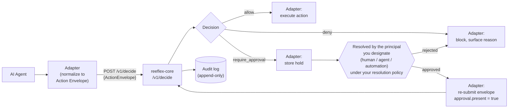
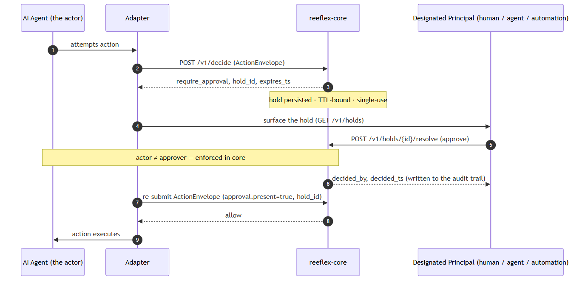
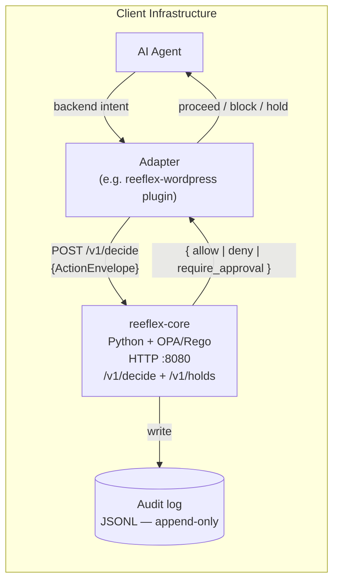
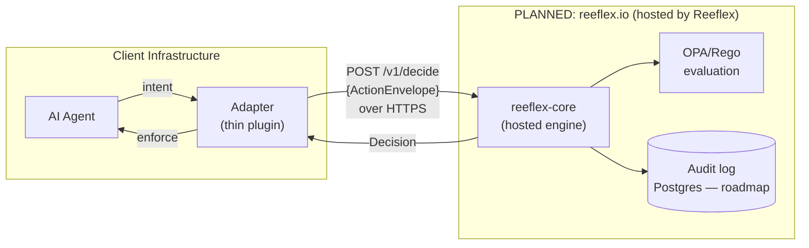

# Reeflex — Architecture

This document describes the decision flow and the two deployment variants. For the recorded decision on deployment sequencing and open-core boundary, see [`docs/adr/0001-deployment-model.md`](adr/0001-deployment-model.md).

---

## Decision flow

An adapter intercepts a backend-specific action, normalizes it into a universal Action Envelope, and posts it to `reeflex-core`. The engine evaluates the envelope against OPA/Rego policy and returns a deterministic decision. The adapter enforces that decision before the backend action executes. On `require_approval`, the adapter stores a **hold** instead of executing; resolving that hold is a separate handover step, covered in [Hold resolution (HIL, HOTL, AIL)](#hold-resolution-hil-hotl-ail) below.

Key invariants:

- **Zero LLM in the decision path.** The engine is OPA/Rego plus classical logic. Free text, markdown, and OKF documents are never decision inputs.
- **Fail-closed.** If the engine is unreachable or OPA cannot be invoked, the adapter denies or holds. There is no configuration that changes this.
- **Deterministic.** Same Action Envelope in, same Decision out — every call, every deployment.
- **Core never executes.** On `require_approval`, `reeflex-core` persists a hold and hands control back to the adapter. Whether the action ultimately runs, is blocked, or is re-submitted after resolution is always decided and carried out by the adapter, never by core.

---

## Hold resolution (HIL, HOTL, AIL)

`require_approval` means **hold** — the principal the operator designates (human, agent, or automation) resolves it before the action can run. The naming and rationale for the three oversight modes (HITL / HOTL / AIL) live in [why-reeflex.md#ail](why-reeflex.md#ail); this section shows only the mechanics.

Shipped in core **v0.1.5** (HIL Phase 1): `GET /v1/holds`, `GET /v1/holds/{id}`,
`POST /v1/holds/{id}/resolve`. The `reeflex-holds` MCP server (see
[`reeflex-holds/README.md`](https://github.com/Reeflex-io/reeflex/blob/main/reeflex-holds/README.md)) exposes the same
three calls as MCP tools to any MCP client — the socket an AIL principal
plugs into.

<!-- mermaid source for the PNG above; regenerate docs/img/hold-resolution-sequence.png after editing:
sequenceDiagram
    autonumber
    participant Requester as AI Agent (the actor)
    participant Adapter
    participant Core as reeflex-core
    participant Principal as Designated Principal (human / agent / automation)

    Requester->>Adapter: attempts action
    Adapter->>Core: POST /v1/decide (ActionEnvelope)
    Core-->>Adapter: require_approval, hold_id, expires_ts
    Note over Core: hold persisted · TTL-bound · single-use
    Adapter->>Principal: surface the hold (GET /v1/holds)
    Principal->>Core: POST /v1/holds/{id}/resolve (approve)
    Note over Requester,Core: actor ≠ approver — enforced in core
    Core-->>Principal: decided_by, decided_ts (written to the audit trail)
    Adapter->>Core: re-submit ActionEnvelope (approval.present=true, hold_id)
    Core-->>Adapter: allow
    Adapter->>Requester: action executes
-->

Two guarantees hold no matter which principal the operator designates:

- **actor ≠ approver.** The agent whose action raised the hold can never
  resolve it — enforced on identity, inside `reeflex-core`, on every surface
  (adapter re-submission and the `reeflex-holds` MCP surface alike).
- R3 (`irreversible_systemic_prod`) is terminal: a systemic action is a `deny`, never a hold — it must be re-scoped and resubmitted, never approved as-is.

Which principal types may resolve which rule is the operator's own choice,
configured via `REEFLEX_RESOLUTION_POLICY`: Reeflex ships human-only by
default; AIL is opt-in, per rule, explicit.

---

## Action Envelope — the three axes

Every backend action is normalized onto three universal axes before evaluation. This is what makes coverage backend-agnostic.

| Axis | Values (ascending risk) |
|---|---|
| `reversibility` | `reversible` → `recoverable` → `irreversible` |
| `blast_radius` | `single` → `scoped` → `broad` → `systemic` |
| `externality` | `internal` → `outbound` → `physical` |

A policy rule like `irreversible + broad + production → require_approval` governs Postgres, S3, and WordPress identically. See [`reeflex-spec/SPEC.md §4`](https://github.com/Reeflex-io/reeflex/blob/main/reeflex-spec/SPEC.md) for the full specification.

---

## Variant A — Full on-prem (available now, free)

Every component runs inside the client's own infrastructure. Decision data — the Action Envelope — never leaves. This is the shipping variant.

Requirements: Python 3.12, OPA 1.x binary, a persistent service process. Does not work on shared hosting (no persistent processes). See [`INSTALL.md`](https://github.com/Reeflex-io/reeflex/blob/main/INSTALL.md). The holds API (`GET /v1/holds`, `POST /v1/holds/{id}/resolve`) is served from this same process, at this same base URL — see [Hold resolution (HIL, HOTL, AIL)](#hold-resolution-hil-hotl-ail) above for the resolution handover.

---

## Variant B — Hosted / subscription

> **PLANNED — not yet available. No hosted engine is currently operated. Do not treat this variant as a current or delivered capability.**

In this variant the client installs only a thin adapter. The adapter calls a Reeflex-operated engine over HTTPS. Works on any hosting environment, including shared hosting.

In this variant the Action Envelope transits Reeflex-operated infrastructure. A data-processing agreement is required before this variant launches — this is an explicit gate in ADR-0001.

Multi-tenancy, authentication, and billing are part of the closed commercial tier and will never appear in this repository.

---

## Open-core boundary

| Tier | Components | License |
|---|---|---|
| Open-source (this repo) | `reeflex-core`, all adapters, base policy packs, `reeflex-spec` | Apache 2.0 |
| Commercial / closed | Multi-tenancy, auth, billing, EU/RO regulated compliance reporting (NIS2/DORA/GDPR), ANAF/SmartBill integrations | Proprietary — never in this repo |

---

## References

- [`reeflex-spec/SPEC.md`](https://github.com/Reeflex-io/reeflex/blob/main/reeflex-spec/SPEC.md) — Action Envelope, Adapter Contract, conformance requirements, §5.1 Approval object semantics (HIL Phase 1)
- [`docs/why-reeflex.md`](why-reeflex.md#ail) — the HITL / HOTL / AIL naming and rationale (source of truth for the coined term; this document only shows the mechanics)
- [`reeflex-holds/README.md`](https://github.com/Reeflex-io/reeflex/blob/main/reeflex-holds/README.md) — the MCP holds surface (`reeflex-holds`), an AIL-capable resolution socket
- [`docs/adr/0001-deployment-model.md`](adr/0001-deployment-model.md) — deployment model decision (engine-as-service, open-core, on-prem-first, hosted = roadmap; embedded-engine alternative documented and rejected)
- [`docs/adr/0002-no-llm-in-decision-path.md`](adr/0002-no-llm-in-decision-path.md) — why zero LLM in `/v1/decide`. (Its §2 uses the earlier "held for a human reviewer" wording that predates AIL; the current resolution model is [why-reeflex.md#ail](why-reeflex.md#ail).)
