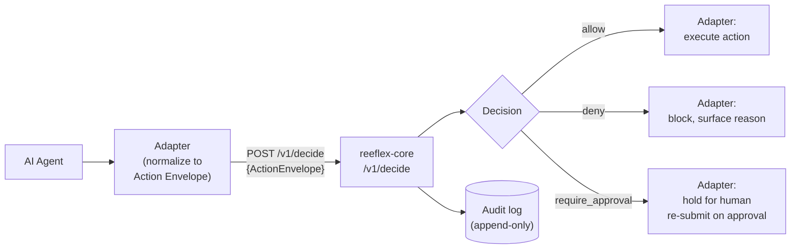
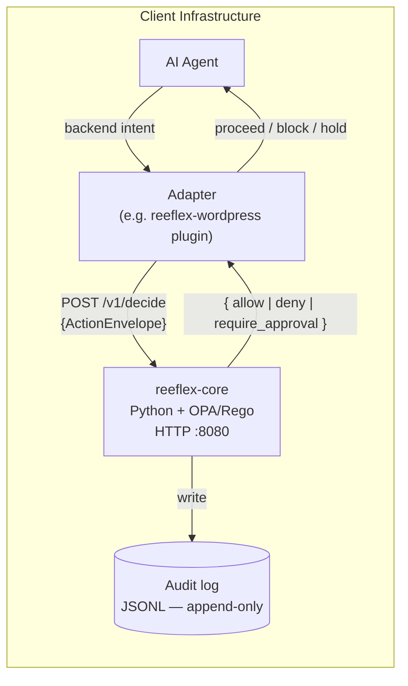
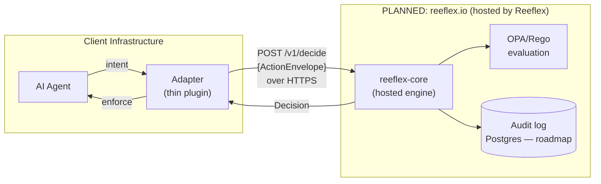

# Reeflex — Architecture

This document describes the decision flow and the two deployment variants. For the recorded decision on deployment sequencing and open-core boundary, see [`docs/adr/0001-deployment-model.md`](adr/0001-deployment-model.md).

---

## Decision flow

An adapter intercepts a backend-specific action, normalizes it into a universal Action Envelope, and posts it to `reeflex-core`. The engine evaluates the envelope against OPA/Rego policy and returns a deterministic decision. The adapter enforces that decision before the backend action executes.

Key invariants:

- **Zero LLM in the decision path.** The engine is OPA/Rego plus classical logic. Free text, markdown, and OKF documents are never decision inputs.
- **Fail-closed.** If the engine is unreachable or OPA cannot be invoked, the adapter denies or holds. There is no configuration that changes this.
- **Deterministic.** Same Action Envelope in, same Decision out — every call, every deployment.

---

## Action Envelope — the three axes

Every backend action is normalized onto three universal axes before evaluation. This is what makes coverage backend-agnostic.

| Axis | Values (ascending risk) |
|---|---|
| `reversibility` | `reversible` → `recoverable` → `irreversible` |
| `blast_radius` | `single` → `scoped` → `broad` → `systemic` |
| `externality` | `internal` → `outbound` → `physical` |

A policy rule like `irreversible + broad + production → require_approval` governs Postgres, S3, and WordPress identically. See [`reeflex-spec/SPEC.md §4`](../reeflex-spec/SPEC.md) for the full specification.

---

## Variant A — Full on-prem (available now, free)

Every component runs inside the client's own infrastructure. Decision data — the Action Envelope — never leaves. This is the shipping variant.

Requirements: Python 3.12, OPA 1.x binary, a persistent service process. Does not work on shared hosting (no persistent processes). See [`INSTALL.md`](../INSTALL.md).

---

## Variant B — Hosted / subscription

> **PLANNED — not yet available. No hosted engine is currently operated. Do not treat this variant as a current or delivered capability.**

In this variant the client installs only a thin adapter. The adapter calls a Reeflex-operated engine over HTTPS. Works on any hosting environment, including shared hosting.

In this variant the Action Envelope transits Reeflex-operated infrastructure. A data-processing agreement is required before this variant launches — this is an explicit gate in ADR-0001.

Multi-tenancy, authentication, and billing are part of the closed commercial tier and will never appear in this repository.

---

## Open-core boundary

| Tier | Components | License |
|---|---|---|
| Open-source (this repo) | `reeflex-core`, all adapters, base policy packs, `reeflex-spec` | Apache 2.0 |
| Commercial / closed | Multi-tenancy, auth, billing, EU/RO regulated compliance reporting (NIS2/DORA/GDPR), ANAF/SmartBill integrations | Proprietary — never in this repo |

---

## References

- [`reeflex-spec/SPEC.md`](../reeflex-spec/SPEC.md) — Action Envelope, Adapter Contract, conformance requirements
- [`docs/adr/0001-deployment-model.md`](adr/0001-deployment-model.md) — deployment model decision (engine-as-service, open-core, on-prem-first, hosted = roadmap; embedded-engine alternative documented and rejected)
- [`docs/adr/0002-no-llm-in-decision-path.md`](adr/0002-no-llm-in-decision-path.md) — why zero LLM in `/v1/decide`
