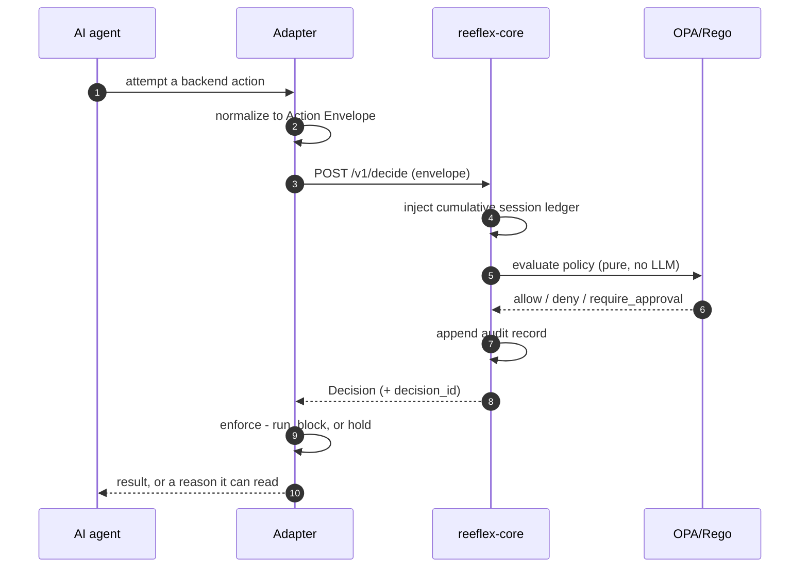
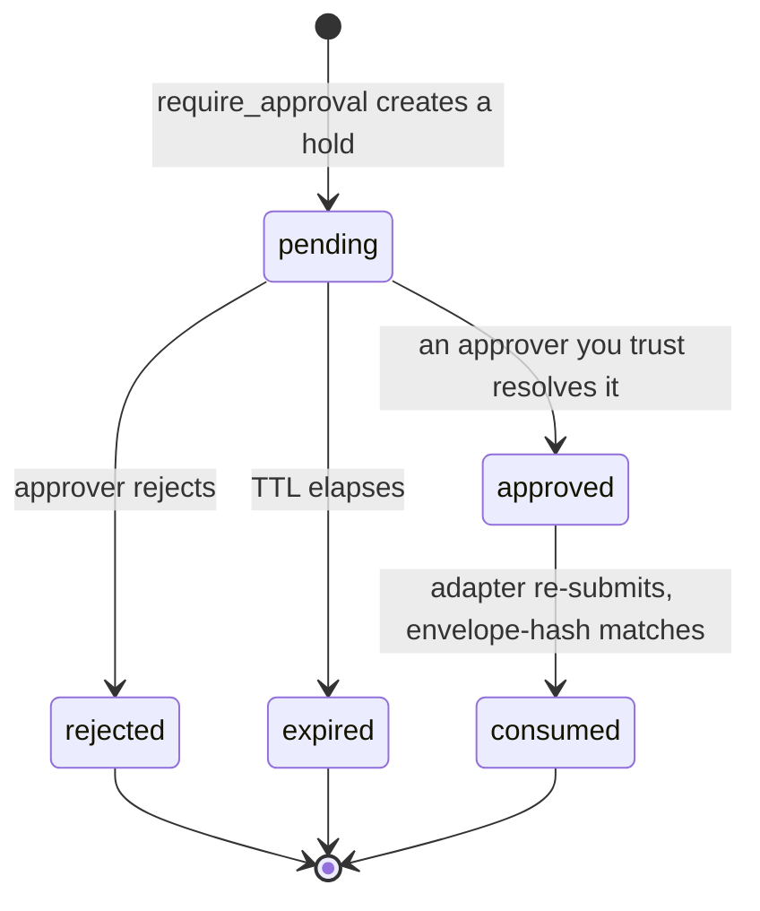
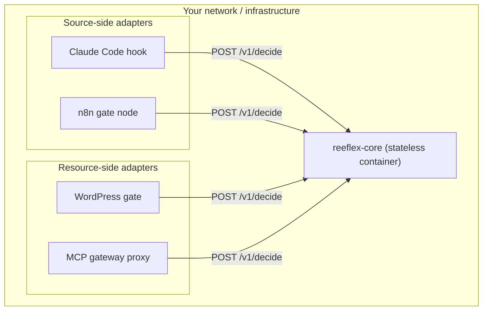
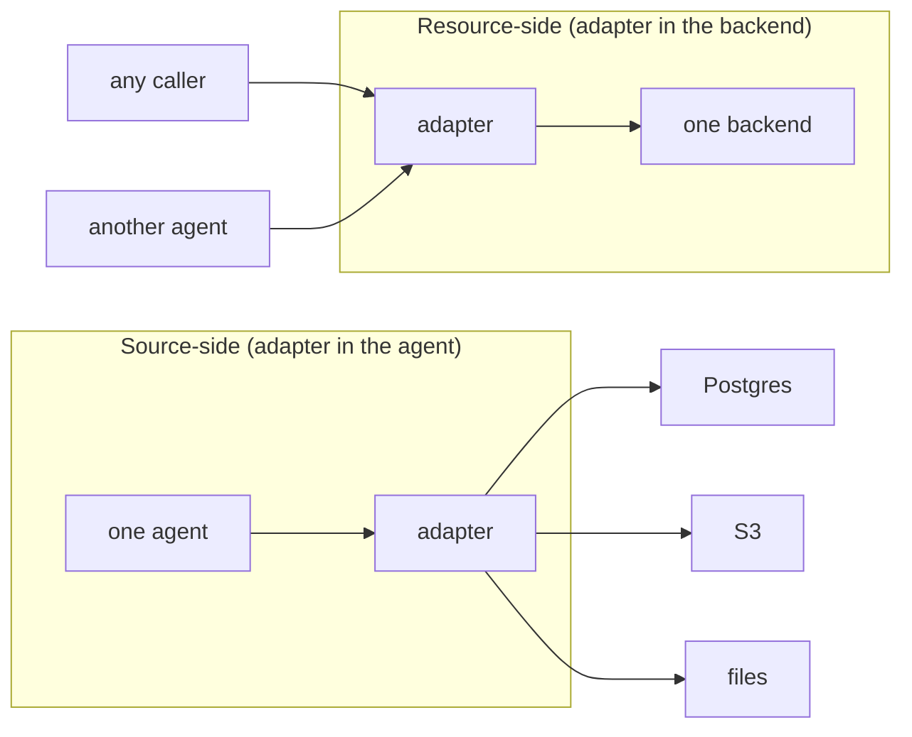

# Architecture diagrams

The single-path system overview (agent -> adapter -> core -> decision) is on
the [Concepts](../concepts/index.md) page. This page goes one level deeper: the
`/v1/decide` round-trip, the hold lifecycle, where things run, and the honest
trade-off between the two ways to place an adapter. For the prose architecture
(seams, guarantees, traceability), see the
[architecture reference](../architecture.md).

## The decision round-trip

*The `/v1/decide` round-trip. The adapter never touches the backend until the
verdict is in; `reeflex-core` decides deterministically over the per-session
ledger and records an audit entry either way. On `require_approval` the adapter
stores a hold instead of executing (next diagram). Same envelope in, same
decision out.*

## Hold lifecycle

*A hold is single-use and time-bound. Core enforces `actor != approver` (the
agent that raised the hold can never resolve it), the TTL (`expires_ts`), and
envelope-hash binding (the approved action is the exact one submitted). Resolve
holds from wp-admin, the [`reeflex-holds` MCP server](../operations/index.md),
or the resolution API. See
[HIL / HOTL / AIL](../why-reeflex.md#ail) for who may resolve what.*

## Deployment: self-hosted, adapters call core

*The only production-supported topology is on-prem: everything runs inside your
own network and no decision data leaves it. `reeflex-core` is a stateless
container; every adapter reaches it over one HTTP call. (An opt-in public eval
endpoint exists for trying it - see [Getting started](../getting-started/index.md).)*

## Adapter placement: source-side vs resource-side

*The honest trade-off. A **source-side** adapter (Claude Code, n8n) governs one
agent wherever it acts - across every backend it touches - but only that agent;
another agent hitting the same backend is ungoverned. A **resource-side**
adapter (WordPress, MCP gateway) governs every caller of one backend, but only
that backend. Neither is strictly better; place adapters at the seam that
matches your threat model, and combine them for defense in depth.*
