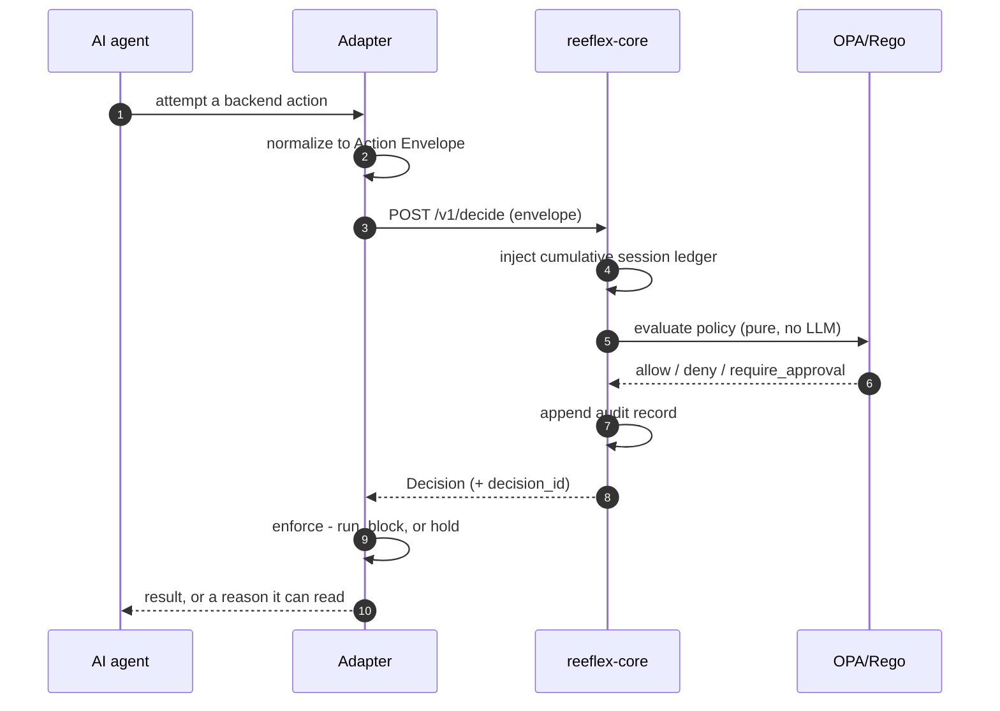
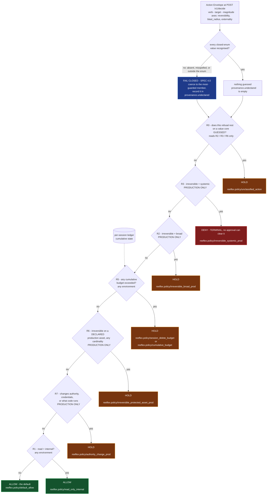
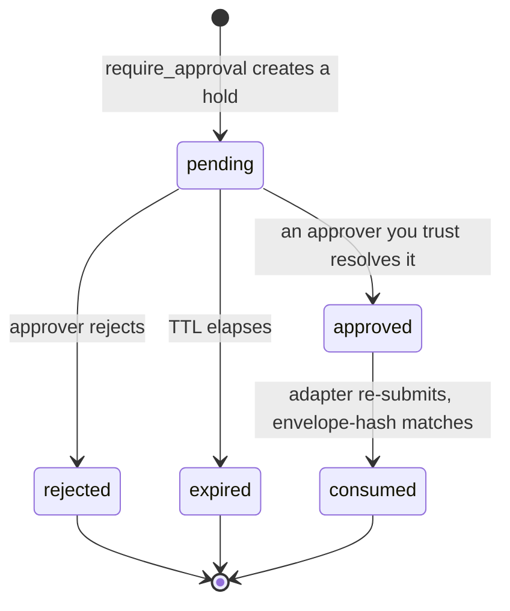
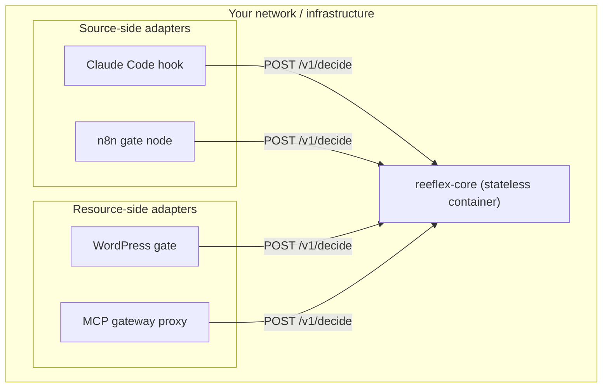
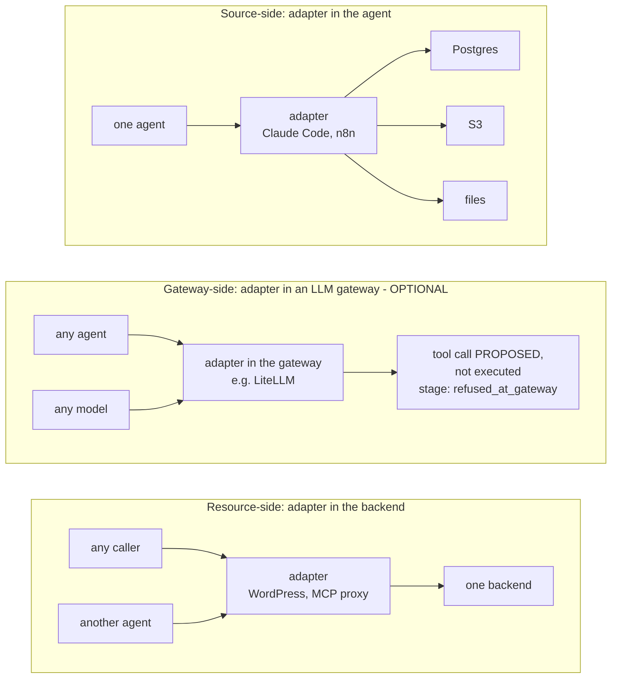

# Architecture diagrams

The single-path system overview (agent -> adapter -> core -> decision) is on
the [Concepts](../concepts/index.md) page. This page goes one level deeper: the
`/v1/decide` round-trip, **how the engine actually reaches a verdict — every
rule, by its real rule id**, the hold lifecycle, where things run, and the
honest trade-off between the three places an adapter can sit. For the prose
architecture (seams, guarantees, traceability), see the
[architecture reference](../architecture.md).

## The decision round-trip

```mermaid
sequenceDiagram
    autonumber
    participant Ag as AI agent
    participant Ad as Adapter
    participant Co as reeflex-core
    participant Op as OPA/Rego
    Ag->>Ad: attempt a backend action
    Ad->>Ad: normalize to Action Envelope
    Ad->>Co: POST /v1/decide (envelope)
    Co->>Co: inject cumulative session ledger
    Co->>Op: evaluate policy (pure, no LLM)
    Op-->>Co: allow / deny / require_approval
    Co->>Co: append audit record
    Co-->>Ad: Decision (+ decision_id)
    Ad->>Ad: enforce - run, block, or hold
    Ad-->>Ag: result, or a reason it can read
```

*The `/v1/decide` round-trip. The adapter never touches the backend until the
verdict is in; `reeflex-core` decides deterministically over the per-session
ledger and records an audit entry either way. On `require_approval` the adapter
stores a hold instead of executing (see the hold lifecycle below). Same envelope
in, same decision out. Step 5 — "evaluate policy" — is the one box this page
used to leave closed; the next diagram opens it.*

## How a verdict is reached

```mermaid
flowchart TD
    EV["Action Envelope at POST /v1/decide
    verb - target - magnitude
    axes: reversibility, blast_radius, externality"]
    CAN{"every closed-enum
    value recognised?"}
    COE["FAIL CLOSED - SPEC 4.0
    coerce to the most-guarded member,
    record it in provenance.undeclared"]
    OK["nothing guessed
    provenance.undeclared is empty"]
    LED[("per-session ledger
    cumulative state")]

    EV --> CAN
    CAN -- "no: absent, misspelled, or outside the enum" --> COE
    CAN -- "yes" --> OK
    COE --> R0
    OK --> R0

    R0{"R0 - does this refusal rest
    on a value core GUESSED?
    reads R2 / R3 / R6 only"}
    R3{"R3 - irreversible + systemic
    PRODUCTION ONLY"}
    R2{"R2 - irreversible + broad
    PRODUCTION ONLY"}
    R5{"R5 - any cumulative
    budget exceeded?
    any environment"}
    R6{"R6 - irreversible on a DECLARED
    production asset, any cardinality
    PRODUCTION ONLY"}
    R7{"R7 - changes authority, credentials,
    or what code runs
    PRODUCTION ONLY"}
    R1{"R1 - read + internal?
    any environment"}

    LED -.-> R5

    R0 -- no --> R3
    R3 -- no --> R2
    R2 -- no --> R5
    R5 -- no --> R6
    R6 -- no --> R7
    R7 -- no --> R1
    R1 -- no --> A4

    H0["HOLD
    reeflex.policy/unclassified_action"]
    D3["DENY - TERMINAL, no approval can clear it
    reeflex.policy/irreversible_systemic_prod"]
    H2["HOLD
    reeflex.policy/irreversible_broad_prod"]
    H5["HOLD
    reeflex.policy/session_delete_budget
    or reeflex.policy/cumulative_budget"]
    H6["HOLD
    reeflex.policy/irreversible_protected_asset_prod"]
    H7["HOLD
    reeflex.policy/authority_change_prod"]
    A1["ALLOW
    reeflex.policy/read_only_internal"]
    A4["ALLOW - the default
    reeflex.policy/default_allow"]

    R0 -- yes --> H0
    R3 -- yes --> D3
    R2 -- yes --> H2
    R5 -- yes --> H5
    R6 -- yes --> H6
    R7 -- yes --> H7
    R1 -- yes --> A1

    classDef deny fill:#7f1d1d,stroke:#ef4444,color:#fff;
    classDef hold fill:#78350f,stroke:#f59e0b,color:#fff;
    classDef allow fill:#14532d,stroke:#22c55e,color:#fff;
    classDef coerce fill:#1e3a8a,stroke:#60a5fa,color:#fff;
    class D3 deny;
    class H0,H2,H5,H6,H7 hold;
    class A1,A4 allow;
    class COE coerce;
```

*How an Action Envelope becomes one verdict. Read it top to bottom: the first
question whose answer is "yes" decides, and nothing below it is consulted.*

*<b>The envelope is cleaned up before any rule sees it.</b> Core accepts only
known values for its closed lists. Anything it does not recognise — a missing
axis, a typo, an environment called `qa-eu` — is replaced with the **most
guarded** value in that list, so an adapter can never buy a softer verdict by
saying less. Core also writes down **which** fields it had to fill in.*

*<b>R0 exists because of what that clean-up used to cause.</b> Fill in three
blanks conservatively and they compose into "irreversible + systemic +
production", which is R3 — the one refusal a human is not allowed to overturn.
So a product whose promise is "when unsure, ask" was answering "when unsure,
refuse". R0 catches exactly that case and turns it into a **hold, not a deny**:
`unclassified_action` says "I could not tell what this was — a human decides",
names the fields core guessed, and is resolvable like any other hold. Measured:
two envelopes that are byte-identical after clean-up, differing only in whether
the adapter declared the values, answer `deny / irreversible_systemic_prod` and
`require_approval / unclassified_action` respectively.*

*<b>Environment decides which rules are even in play.</b> R2, R3, R6 and R7 all
require `target.environment == "production"`. In `dev` or `staging` only R1, R5
and R4 can fire — measured over all 864 combinations of the three axes, three
verbs, two refs and two abilities: outside production the only rule ids that
appear are `read_only_internal` and `default_allow`. R5 is deliberately not
environment-gated; a budget is about accumulation, not about where.*

*<b>R3 is the only terminal deny.</b> Every other refusal on this page is a
hold, and a hold is resolvable by an approver you designate. Core enforces that
asymmetry in code, not just in policy: `NON_RESOLVABLE_RULES` contains
`irreversible_systemic_prod` and nothing else, so an attempt to approve an R3
is refused with `rule_not_resolvable`.*

*<b>Total precedence is `deny > require_approval > allow`</b> — with one
deliberate exception, R0, which outranks even the deny. The reasoning is worth
stating plainly: a deny that rests on a value core invented is not a control
doing its job, it is a coverage gap that happens to look strict, and the two
should not be reported under the same rule id. Among the holds the order is
R2 → R5 → R6 → R7, and it is a reporting decision rather than a safety one:
each of those returns `require_approval` either way, so the ordering only picks
which reason the operator reads. The ladder above is the order the shipped file
evaluates in, verified by building envelopes where two rules genuinely co-fire
and recording which id won.*

*The rule bodies are in
[`reeflex-core/policy/reeflex.rego`](https://github.com/Reeflex-io/reeflex/blob/main/reeflex-core/policy/reeflex.rego),
with R5's budgets, R6's asset list and R7's signal lists in the sibling
`budgets.rego`, `protected.rego` and `authority.rego` — all four are files you
are meant to edit. See the [policy guide](../policy-guide.md) to change a
threshold or add a rule of your own.*

## Hold lifecycle

```mermaid
stateDiagram-v2
    [*] --> pending: require_approval creates a hold
    pending --> approved: an approver you trust resolves it
    pending --> rejected: approver rejects
    pending --> expired: TTL elapses
    approved --> consumed: adapter re-submits, envelope-hash matches
    rejected --> [*]
    expired --> [*]
    consumed --> [*]
```

*A hold is single-use and time-bound. Core enforces `actor != approver` (the
agent that raised the hold can never resolve it), the TTL (`expires_ts`), and
envelope-hash binding (the approved action is the exact one submitted). Resolve
holds from wp-admin, the [`reeflex-holds` MCP server](../operations/index.md),
or the resolution API. See
[HIL / HOTL / AIL](../why-reeflex.md#ail) for who may resolve what.*

## Deployment: self-hosted, adapters call core

```mermaid
flowchart TB
    subgraph net["Your network / infrastructure"]
        core["reeflex-core (stateless container)"]
        subgraph src["Source-side adapters"]
            cc["Claude Code hook"]
            n8["n8n gate node"]
        end
        subgraph res["Resource-side adapters"]
            wp["WordPress gate"]
            gw["MCP gateway proxy"]
        end
    end
    cc -- "POST /v1/decide" --> core
    n8 -- "POST /v1/decide" --> core
    wp -- "POST /v1/decide" --> core
    gw -- "POST /v1/decide" --> core
```

*The only production-supported topology is on-prem: everything runs inside your
own network and no decision data leaves it. `reeflex-core` is a stateless
container; every adapter reaches it over one HTTP call. (An opt-in public eval
endpoint exists for trying it - see [Getting started](../getting-started/index.md).)*

## Adapter placement: three seams

```mermaid
flowchart TB
    subgraph SRC["Source-side: adapter in the agent"]
        direction LR
        AG["one agent"] --> AD1["adapter
        Claude Code, n8n"]
        AD1 --> B1["Postgres"]
        AD1 --> B2["S3"]
        AD1 --> B3["files"]
    end

    subgraph GW["Gateway-side: adapter in an LLM gateway - OPTIONAL"]
        direction LR
        G1["any agent"] --> AD3["adapter in the gateway
        e.g. LiteLLM"]
        G2["any model"] --> AD3
        AD3 --> P1["tool call PROPOSED,
        not executed
        stage: refused_at_gateway"]
    end

    subgraph RES["Resource-side: adapter in the backend"]
        direction LR
        C1["any caller"] --> AD2["adapter
        WordPress, MCP proxy"]
        C2["another agent"] --> AD2
        AD2 --> DB["one backend"]
    end

    %% Invisible links: keep the three seams in reading order.
    SRC ~~~ GW ~~~ RES
```

*The honest trade-off, in three places you can put a seam. Each governs a
different set, and none of them is a prerequisite for the others.*

*<b>Source-side</b> — the adapter lives in the agent (Claude Code hook, n8n
node). It governs **one agent wherever it acts**, across every backend it
touches. Another agent hitting the same backend is ungoverned.*

*<b>Gateway-side</b> — the adapter lives in an LLM gateway. It governs **every
agent behind that gateway, whatever model they use**, and it does so at
proposal time. This seam is **optional**: it exists for teams that already run
a gateway, and Reeflex neither ships one nor requires one.
[LiteLLM](https://docs.litellm.ai/) is the instance we ship an adapter for, and
it is an example of the seam, not a dependency of the product — if you do not
run a gateway, the other two seams work exactly as they do above.*

*<b>The gateway seam's honest limit, because it changes what it is worth.</b> A
gateway sees a tool call **proposed by the model**, not executed. Refusing
there stops the proposal from ever reaching the agent — the refusal is recorded
as `stage: refused_at_gateway` — but nothing at that seam observes the action
actually running, and an agent that acts without going back through the gateway
is outside it entirely. **It is not a substitute for an execution-side seat.***

*<b>Resource-side</b> — the adapter lives in the backend (WordPress, MCP
gateway proxy). It governs **every caller of one backend**, including callers
you did not know about, but only that backend.*

*Neither ordering nor exclusivity is implied: place a seam where it matches
your threat model, and combine them for defence in depth — the gateway refuses
what the model proposes, the source-side hook governs the agent you run, and
the resource-side adapter catches whoever else arrives. The claim this diagram
carries is that Reeflex fits the architecture you already have, rather than
asking you to adopt one.*
