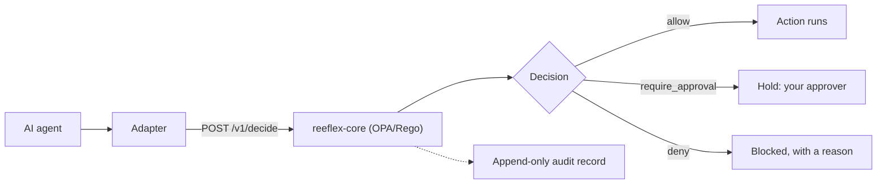

# Concepts

A **decision firewall** is a deterministic gate that judges what an AI agent's
action would DO — its reversibility, blast radius, and cumulative session impact
— and allows, holds, or denies it before it reaches your systems, independent of
which agent is asking.

Agent firewalls that inspect network *traffic* — prompts, tokens, requests at
the network edge — already exist; a decision firewall is not one of those. It
inspects the *action*: it prices what the action would actually do and rules on
that, so a fully authenticated agent with a clean prompt is still stopped before
it deletes 500 records. Same idea as a network firewall — a checkpoint that
allows or blocks — moved from packets to **agent actions**.

Reeflex governs **actions**, not tools. Every backend action an agent attempts
is normalized into one universal shape and priced on risk, so a single
deterministic engine governs Postgres, S3, WordPress, and a coding agent
identically.

Every action takes the same path: an **agent** attempts a backend action; an
**adapter** normalizes it into an Action Envelope and `POST`s it to
**`reeflex-core`**; the engine decides with pure OPA/Rego over a per-session
ledger and returns allow /
hold /
deny; the adapter enforces that verdict
and writes an append-only audit record either way.

*System overview. Every action takes this path exactly once: the adapter
normalizes it and asks `reeflex-core`, the engine decides deterministically over
the per-session ledger, and the adapter enforces the verdict — writing an audit
record either way. The `/v1/decide` sequence and the hold lifecycle are in
[Architecture](../architecture.md).*

## The core ideas

- **The Action Envelope** — verb + three risk axes (`reversibility`,
  `blast_radius`, `externality`) + magnitude + a stable `session_id`. The
  portable contract between any adapter and the engine.
  ([SPEC §2](https://github.com/Reeflex-io/reeflex/blob/main/reeflex-spec/SPEC.md))
- **The five rules (R1–R5)** — deterministic allow / hold / deny with total
  precedence (`deny > require_approval > allow`). **R2 and R3 are gated on
  `production`**: in `dev` or `staging`, only R1, R4, and R5 apply.
  ([policy guide](https://github.com/Reeflex-io/reeflex/blob/main/docs/policy-guide.md))
- **Decisions** — `allow`, `require_approval` (hold), `deny`. The engine
  **fails closed**: if OPA is unreachable or a policy is ambiguous, the answer
  is `deny`, never `allow`.
- **Sessions & the cumulative ledger** — R5 tracks cumulative deletes per
  `session_id`, so splitting one big dangerous action into many small ones
  (fragmentation) buys nothing.
- **HIL / HOTL / AIL** — a hold is resolved by an approver you designate: a
  human (HITL) or an agent you trust (AIL). The canonical definition lives in
  [why-reeflex.md#ail](https://github.com/Reeflex-io/reeflex/blob/main/docs/why-reeflex.md#ail)
  — these docs link it, never fork it.
- **What the base policy does *not* catch** — documented honestly rather than
  hidden.
  ([IMPACT-MODEL](https://github.com/Reeflex-io/reeflex/blob/main/reeflex-spec/IMPACT-MODEL.md#what-the-base-policy-does-not-catch))

---

*Each concept above is being expanded into its own page under this section,
built from the honest source already in the repository.*
