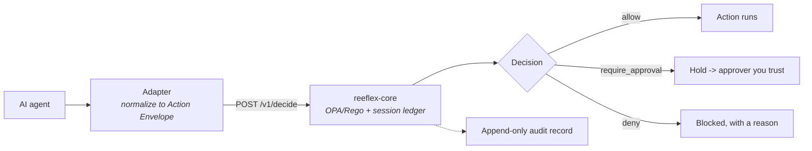

# Concepts

Reeflex governs **actions**, not tools. Every backend action an agent attempts
is normalized into one universal shape and priced on risk, so a single
deterministic engine governs Postgres, S3, WordPress, and a coding agent
identically.

*Every action takes the same path: an adapter normalizes it, `reeflex-core`
decides with pure OPA/Rego, and the adapter enforces the verdict — recording an
audit entry either way.*

## The core ideas

- **The Action Envelope** — verb + three risk axes (`reversibility`,
  `blast_radius`, `externality`) + magnitude + a stable `session_id`. The
  portable contract between any adapter and the engine.
  ([SPEC §2](https://github.com/Reeflex-io/reeflex/blob/main/reeflex-spec/SPEC.md))
- **The five rules (R1–R5)** — deterministic allow / hold / deny with total
  precedence (`deny > require_approval > allow`). **R2 and R3 are gated on
  `production`**: in `dev` or `staging`, only R1, R4, and R5 apply.
  ([policy guide](https://github.com/Reeflex-io/reeflex/blob/main/docs/policy-guide.md))
- **Decisions** — `allow`, `require_approval` (hold), `deny`. The engine
  **fails closed**: if OPA is unreachable or a policy is ambiguous, the answer
  is `deny`, never `allow`.
- **Sessions & the cumulative ledger** — R5 tracks cumulative deletes per
  `session_id`, so splitting one big dangerous action into many small ones
  (fragmentation) buys nothing.
- **HIL / HOTL / AIL** — a hold is resolved by an approver you designate: a
  human (HITL) or an agent you trust (AIL). The canonical definition lives in
  [why-reeflex.md#ail](https://github.com/Reeflex-io/reeflex/blob/main/docs/why-reeflex.md#ail)
  — these docs link it, never fork it.
- **What the base policy does *not* catch** — documented honestly rather than
  hidden.
  ([IMPACT-MODEL](https://github.com/Reeflex-io/reeflex/blob/main/reeflex-spec/IMPACT-MODEL.md#what-the-base-policy-does-not-catch))

---

*Each concept above is being expanded into its own page under this section,
built from the honest source already in the repository.*
