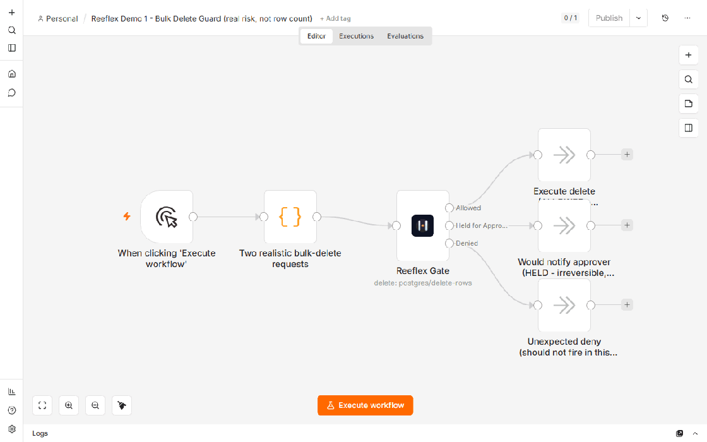
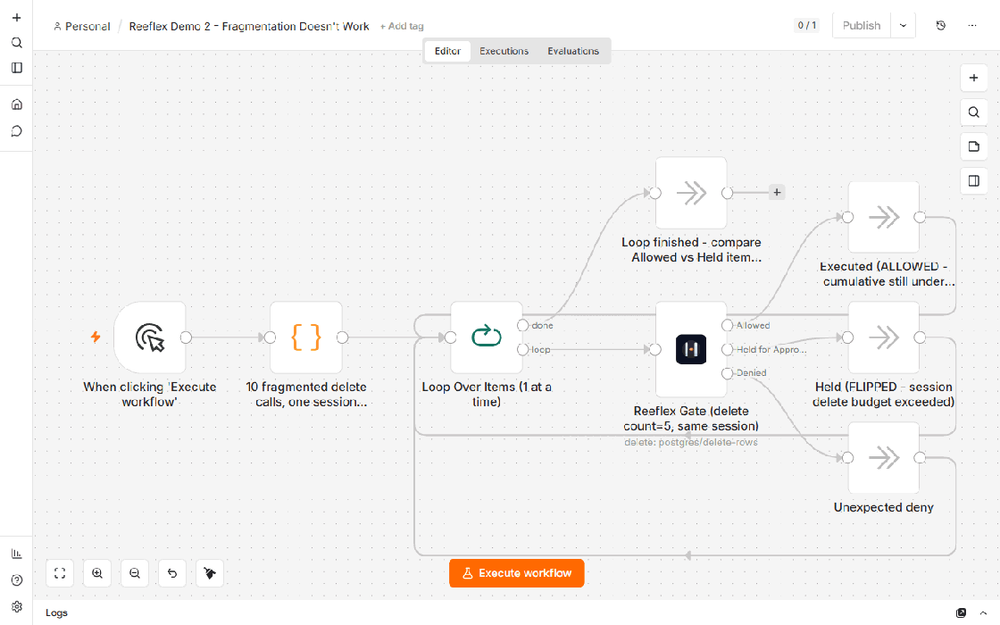
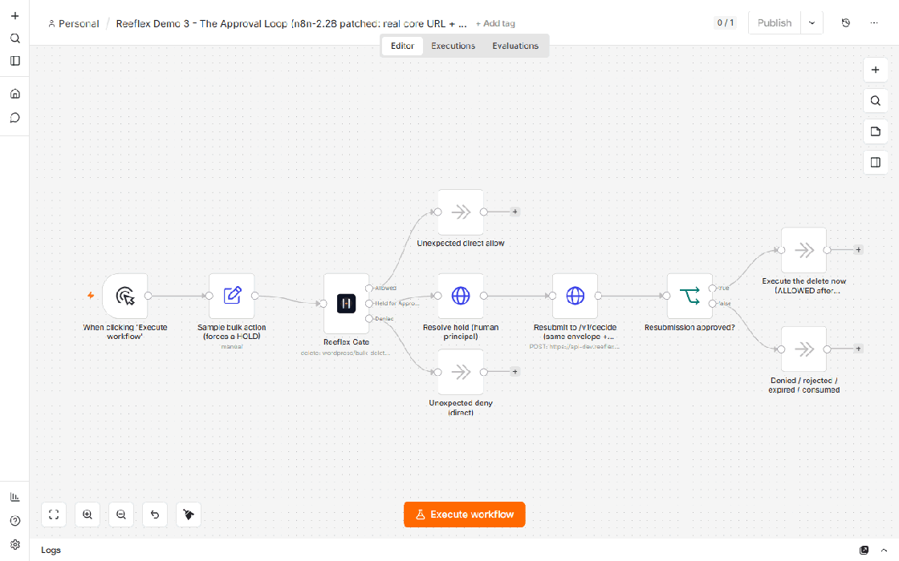
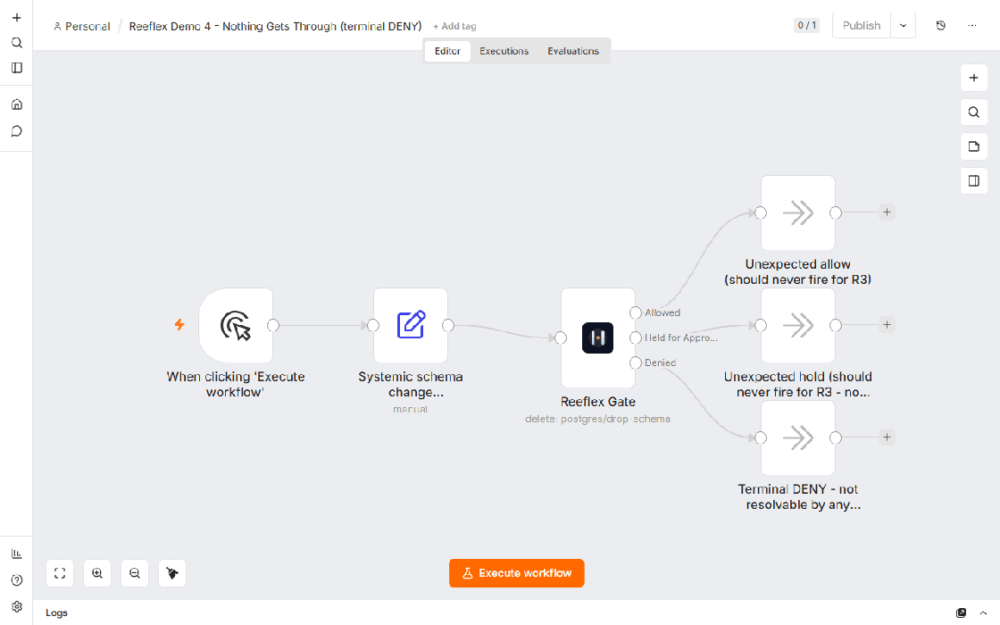
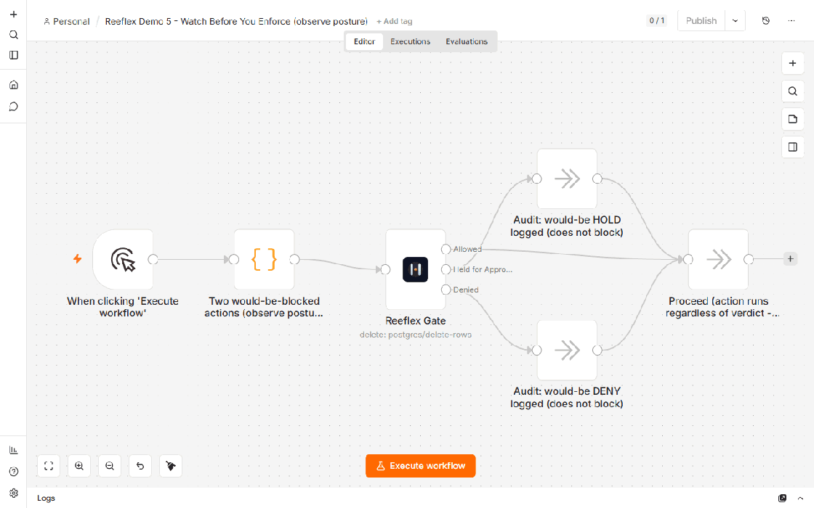
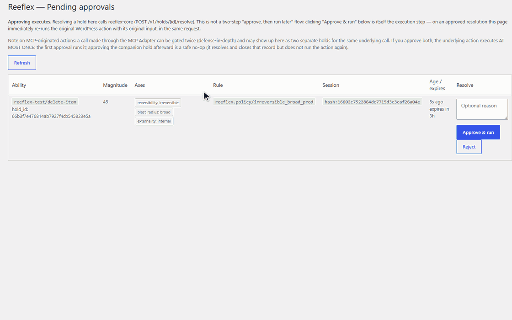

# Reeflex n8n demos

Five small, importable n8n workflows that each teach ONE thing about
governing agent actions with [Reeflex](https://reeflex.io) via the
[`n8n-nodes-reeflex`](../../README.md) community node (**Reeflex Gate**).
Every demo is preconfigured against the live, public **api-dev** eval
endpoint, so you can import and run each one in a couple of minutes with no
infrastructure of your own.

> **Disclaimer:** Eval token for api-dev.reeflex.io — dev endpoint,
> rate-limited, may reset anytime; not for production.

## The 5 demos

| # | File | Teaches |
|---|---|---|
| 1 | [`demo1-bulk-delete-guard.workflow.json`](./demo1-bulk-delete-guard.workflow.json) ([README](./demo1-README.md)) | One gate, two real bulk-delete requests — verdict follows the DECLARED RISK AXES, not row count. |
| 2 | [`demo2-fragmentation-doesnt-work.workflow.json`](./demo2-fragmentation-doesnt-work.workflow.json) ([README](./demo2-README.md)) | Splitting one big delete into many small calls under the SAME session does not reset the budget — reeflex-core accumulates per session. |
| 3 | [`demo3-the-approval-loop.workflow.json`](./demo3-the-approval-loop.workflow.json) ([README](./demo3-README.md)) | The full human-in-the-loop cycle: decide → HOLD → resolve → resubmit → allow. |
| 4 | [`demo4-nothing-gets-through.workflow.json`](./demo4-nothing-gets-through.workflow.json) ([README](./demo4-README.md)) | Some actions get a TERMINAL deny — no hold, no principal can ever approve it. |
| 5 | [`demo5-watch-before-you-enforce.workflow.json`](./demo5-watch-before-you-enforce.workflow.json) ([README](./demo5-README.md)) | "Observe" is a WORKFLOW POSTURE (log the verdict, proceed anyway), not a reeflex-core mode. |

Each demo's own README has the full story, the exact expected result, and an
honesty note about what is real versus what needs your own core. A GIF of
each demo running against api-dev is embedded at the bottom of this page.

## Prerequisites

- n8n with community nodes support (Node.js >= 20.15 for the node itself).
- The `n8n-nodes-reeflex` package installed. **As of this writing the
  package is prepared but not yet published to npm** (publishing is a
  human-only GATE — see
  [`../../PUBLISH.md`](../../PUBLISH.md)). Until it is published:
  - From a clone of this repo, `cd n8n-nodes-reeflex && npm run dev` starts
    a local n8n instance (default `http://localhost:5678`) with Reeflex
    Gate already loaded — the fastest way to try these demos today (see
    `PUBLISH.md` section 2, "Manual smoke test in a real n8n instance").
  - Once published, follow the standard
    [community node install flow](https://docs.n8n.io/integrations/community-nodes/installation-and-management/)
    with the package name `n8n-nodes-reeflex` instead.

## Credential setup — "Reeflex Core API" (one credential, all 5 demos)

Every demo references the same credential type (`Reeflex API`, internal
name `reeflexApi`) rather than embedding any secret in the workflow JSON —
n8n workflow exports never contain credential values, only a reference to a
credential by name/id that you create locally.

### Import a demo in 2 minutes

1. In n8n, go to **Credentials → New → Reeflex API** and fill in exactly
   these 3 values:

   | Field | Value |
   |---|---|
   | Core URL | `https://api-dev.reeflex.io` |
   | API Token | `reeflex-eval-public-2026` |
   | Ignore SSL Issues (Insecure) | **OFF** (default — api-dev has a valid, publicly-trusted certificate) |

   Save it as, for example, "Reeflex Core API account" (any name works —
   only the credential TYPE matters for import).
2. **Workflows → Import from File**, pick one of the 5 `.workflow.json`
   files in this directory.
3. Open every **Reeflex Gate** node (and, in demo 3, the two HTTP Request
   nodes that also use this credential) and re-select the credential you
   just created — the imported JSON references a placeholder credential id
   (`REPLACE_WITH_YOUR_CREDENTIAL_ID`) that does not exist in your instance
   yet; this is standard for any n8n workflow export that uses credentials.
4. Click **Execute workflow** and follow the item count on each output
   branch (see the demo's own README for what to expect).

> Same disclaimer as above: this is the shared public eval endpoint — do
> not point real/production actions at it, and expect it to reset or be
> rate-limited without notice.

## Why these are honest about what works and what doesn't

Every demo is only claimed to work against api-dev when it genuinely does,
verified against `reeflex-core`'s actual policy pack
(`reeflex-core/policy/reeflex.rego`, rules R1–R5) and Holds API
(`reeflex-core/README.md`, HIL Phase 1). Two things a shared, operator-run
endpoint cannot demonstrate are called out explicitly rather than faked:

- **Demo 3** documents (in its own README, not in the JSON) the
  `REEFLEX_WEBHOOK_URL` / n8n Webhook trigger variant for operators running
  their own core — not the default here, because a webhook is global to one
  core instance and cannot be routed per-importer on a shared endpoint.
- **Demo 4** documents (in its own README, not in the JSON) that
  `REEFLEX_FREEZE` is an operator-side environment variable on the core
  server — an importer of this workflow cannot flip it on the shared
  api-dev endpoint. That half of the demo is filmed later (T7) against a
  local core.

## GIFs

Each GIF below is a real run of that demo in the n8n editor against the live
api-dev eval endpoint — the item flowing through the nodes and the verdict
`reeflex-core` actually returned (nothing is mocked; the verdicts were
cross-checked against the API).

### 1 — Bulk Delete Guard
Real risk, not row count: a small recoverable delete just passes; a large
irreversible one holds for approval.

### 2 — Fragmentation Doesn't Work
Splitting one big delete into ten small calls under the same session doesn't
dodge the gate — the per-session ledger accumulates and flips to a hold
mid-loop.

### 3 — The Approval Loop
The full human-in-the-loop cycle: decide → HOLD → resolve → resubmit → allow.

### 4 — Nothing Gets Through
An irreversible + systemic production action is a terminal deny — no hold, no
principal can approve it.

### 5 — Watch Before You Enforce
Observe posture: log the would-be verdict, let the action proceed, enforce
later. "Observe" is a workflow choice, not a core mode.

### 6 — The Approval, Live
The human side of demo 3's loop, captured in the WordPress adapter's
"Pending approvals" surface (not the n8n editor): a single held action →
click **Approve & run** → "Approved and executed." and the row clears to
"No pending holds." One action produces exactly one hold (the fan-out fix),
resolved by the principal you designate — see
[why-reeflex.md#ail](../../../docs/why-reeflex.md#ail).

