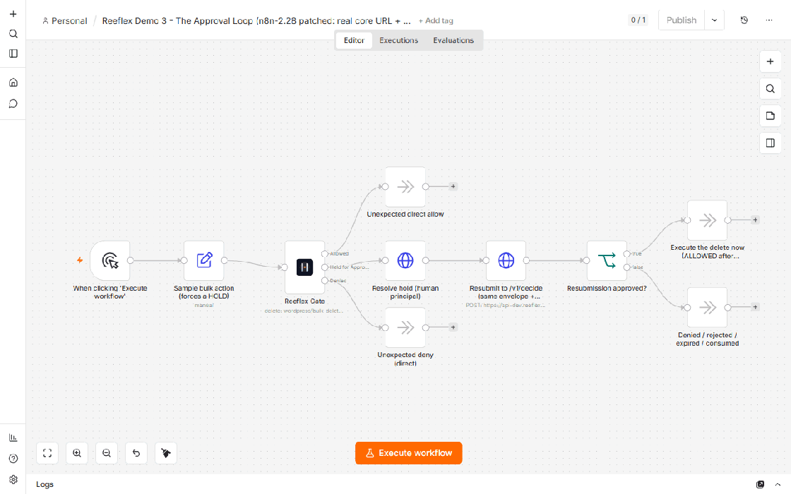

# Demo 3 — The Approval Loop

**Teaches:** the full approval cycle end to end — decide → HOLD (`hold_id`
returned) → resolve the hold → resubmit the SAME envelope with approval →
allow.

> ### ⚠️ There is no human in this workflow. Do not ship it.
>
> This demo shows the **mechanics** of the hold cycle, and to fit them in one
> click the workflow **resolves its own hold**, with the same credential the
> acting agent uses. Measured end to end against api-dev: an
> `irreversible + broad + production` bulk delete of 25 posts goes from
> `require_approval` to `allow` with **no human consulted at any point**.
>
> reeflex-core cannot tell the difference. `principal: {type: "human", id: …}`
> is **self-asserted by whoever holds the token** — an id that exists nowhere,
> belongs to nobody, and was never asked, resolves the hold with HTTP 200.
> The only things core checks are that the type is one the rule allows, that
> the id is non-empty, and that it differs from the acting agent's id
> (`403 actor_is_approver`). None of those is a check that a person decided.
>
> **If you copy the "Resolve hold" node into a production workflow you have
> built an Art.14 human-oversight loop with no human in it**, and the evidence
> trail will name an approver who does not exist. Step 3 belongs to a real
> person, out of band — the WordPress "Pending approvals" surface, an MCP
> client, your own approval UI, or the webhook variant documented at the
> bottom of this page. Delete that node before you adapt this workflow.

File: [`demo3-the-approval-loop.workflow.json`](./demo3-the-approval-loop.workflow.json)

## Setup

See the top-level [README.md](./README.md) → "Credential setup" for the
exact 3 values (Core URL / API Token / Ignore SSL Issues) and the 2-minute
import steps. **This demo also needs the credential attached to the two
HTTP Request nodes** ("Resolve hold" and "Resubmit to /v1/decide"), not just
the Reeflex Gate node — they use the same "Reeflex Core API" credential via
n8n's **Authentication: Predefined Credential Type → Reeflex API**, so the
Bearer **token** is injected from that credential and no secret is duplicated
in the workflow.

> **n8n specifics for the two HTTP Request nodes** (verified on n8n 2.28):
> - The **core host is hardcoded** to `https://api-dev.reeflex.io` in both
>   HTTP node URLs, because n8n does **not** expose credential fields like
>   `{{$credentials.coreUrl}}` to an HTTP Request node's URL under
>   `predefinedCredentialType` (the Reeflex Gate node reads its URL from the
>   credential internally; raw HTTP Request nodes cannot). If you point the
>   credential at your own core, **edit these two URLs to match.**
> - The resubmit node **regenerates `meta.nonce`** (see step 4) — required, or
>   core rejects the reused nonce as a replay (`400`).

> Disclaimer: Eval token for api-dev.reeflex.io — dev endpoint,
> rate-limited, may reset anytime; not for production.

## The story

1. A sample action (`wordpress/bulk-delete-posts`, 25 posts, irreversible +
   broad + production) is deliberately built to trip R2 every time — this
   demo is about what happens AFTER a hold exists, not about whether one
   gets created (see [demo1](./demo1-README.md) for that).
2. **Reeflex Gate** returns `require_approval` with `hold_id` and
   `expires_ts`. The item on the "Held for Approval" output also carries
   `reeflex.envelope` — the exact envelope that was sent, unmodified.
3. **Resolve hold (human principal)** — an HTTP Request node POSTs
   `/v1/holds/{hold_id}/resolve` with:
   ```json
   { "decision": "approve", "principal": { "type": "human", "id": "demo3-approver" }, "reason": "approved via n8n demo3 - the approval loop" }
   ```
   `human` is one of three principal types core recognizes (human / agent /
   automation — see `reeflex-core/README.md`, "Approval principals"). This
   demo uses `human` for two concrete reasons: (a) it is the **only** type
   api-dev's default resolution policy accepts out of the box — resolving
   with `agent` or `automation` there returns `403 principal_type_not_allowed`
   unless the operator has allowed that type for this rule via
   `REEFLEX_RESOLUTION_POLICY`; and (b) the id (`demo3-approver`) **must
   differ from the acting agent** (`agent:n8n-demo3-approval-loop`) or core
   returns `403 actor_is_approver` — the approver can never be the actor.
   This step records the approval; it does **not** re-run the guarded action.
4. **Resubmit to /v1/decide** — a second HTTP Request node reuses
   `reeflex.envelope` from the Reeflex Gate node (spreads it, then sets
   `approval.present = true` and `approval.hold_id`). `action`, `axes`,
   `magnitude`, and `target` stay byte-identical to the original, because
   core's hash binding is computed over exactly those fields
   (`reeflex-core/README.md`, "The hash binding") — a resubmission with a
   modified action would come back `deny` with
   `reeflex_hold_envelope_mismatch`. **One field is deliberately NOT reused:
   `meta.nonce` is regenerated.** Core's replay protection rejects a repeated
   nonce with `400 invalid_envelope "replay: nonce already seen"`, so a naive
   verbatim spread (which still carries the first call's nonce) fails at this
   step; regenerating `meta.nonce` keeps the hash-bound action fields intact
   while satisfying replay protection — exactly what reeflex-core's own HIL
   resubmit tests do.
5. **Resubmission approved?** (IF node) — checks `decision == "allow"`
   before treating the loop as successful. Never assume; always check.

## Expected result when you run it

- First `/v1/decide` call: `require_approval`, `hold_id` present.
- Resolve call: HTTP 200, hold `status: "approved"`.
- Second `/v1/decide` call: `allow`.
- Final branch: "Execute the delete now (ALLOWED after approval)".

## Honesty note — what's real vs. documented-only

This entire loop (steps 1–5 above) is **fully live and works exactly as
described against the shared api-dev endpoint** — nothing here is
simulated. **That is precisely the problem, and it is not a simplification:
the workflow POSTs the resolve step itself, so the loop completes with zero
humans** (see the warning at the top of this page). In a real deployment a
real person must resolve the hold out of band — via the WordPress "Pending
approvals" surface, an MCP client like Claude Desktop, or your own approval
UI — and **nothing in reeflex-core enforces that**; it is a property of how
you wire step 3, not of the product.

The four mechanics core does enforce were each verified against a live core,
and all four hold: **single-use hold** (a second resubmission of one approved
hold returns `reeflex_hold_consumed`), **TTL**, **action-hash binding** (a
hold raised for action A, attached to action B, returns
`reeflex_hold_envelope_mismatch`; an invented `hold_id` returns
`reeflex_hold_not_found`; `approval.present: true` with no `hold_id` also
returns `reeflex_hold_not_found`), and **actor≠approver** (including
`reeflex_hold_actor_mismatch` if the resubmitting agent is not the one the
approval was granted to). What none of the four is, is a check that a human
decided anything.

**Not implemented in this JSON, documented here instead:** the
**webhook-trigger variant**. `reeflex-core` can push a `hold.created`
webhook to `REEFLEX_WEBHOOK_URL` the moment a hold is created, so instead of
this workflow calling `/v1/holds/{id}/resolve` itself, a *separate*
n8n workflow with a **Webhook** trigger node could receive that event and
drive the approval UI (Slack button, ticketing system, etc. — see
[`../../docs/guides/n8n.md`](../../docs/guides/n8n.md), section 3, and
`reeflex-core/README.md`, "Outbound hold webhook"). This is **not** the
default here for one concrete reason: `REEFLEX_WEBHOOK_URL` is a single,
global setting on the core server, and it fires for **every** hold on that
instance, not scoped to one importer's execution. On a shared,
multi-tenant endpoint like api-dev, there is no way to route that one
global webhook to *your* n8n instance without an intermediate receiver that
looks up the right waiting execution by `hold_id` — exactly the situation
`docs/guides/n8n.md` calls out as "exactly why the dedicated
`n8n-nodes-reeflex` package exists as the next step up from this zero-code
guide." If you run your **own** `reeflex-core` instance, set
`REEFLEX_WEBHOOK_URL` to an n8n **Wait node's** webhook URL (Webhook mode)
and you get the fully event-driven variant — no polling, no manual "Resolve
hold" HTTP call needed on your side (a human resolving the hold externally,
e.g. via Slack, triggers the webhook directly). This variant is not filmed
in the T7 GIF plan for this repo (it needs a dedicated core instance to
demonstrate correctly); the human-principal HTTP-based loop above is
what gets filmed, since it is what genuinely works against api-dev out of
the box.

## GIF (filmed at T7)



**How to film:** import into a local n8n (Docker), attach the credential to
all 3 nodes that need it (Reeflex Gate + 2 HTTP Request nodes), click
"Execute workflow" once, and let it run end to end (4 sequential HTTP
calls: decide, resolve, resubmit, then the IF).

**What you'll see:** the item passing through Held → Resolve hold →
Resubmit → the IF node routing to "Execute the delete now (ALLOWED after
approval)" — open the "Resubmit to /v1/decide" node's output panel to show
`decision: "allow"` where the first call had returned
`decision: "require_approval"` for the exact same underlying action.
