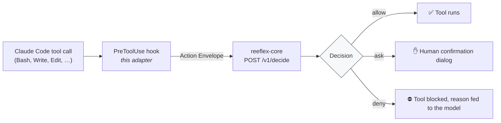

# reeflex-claude

Reference adapter: Claude Code PreToolUse hook for [Reeflex](https://reeflex.io) governance.

**What it is:** A Reeflex adapter that governs Claude Code tool calls by implementing the
four contract responsibilities (SPEC §6): INTERCEPT → NORMALIZE → ENFORCE → AUDIT.

**What it is NOT:** It does not decide anything.  The decision is made deterministically
by `reeflex-core` (OPA/Rego).  Zero LLM anywhere near the decision path.

## How it works

Claude Code fires a `PreToolUse` hook before every tool call.  This adapter:

1. **INTERCEPT** — receives the tool call JSON on stdin (before execution).
2. **NORMALIZE** — maps the tool call to a signed Action Envelope (SPEC §2):
   verb, three risk axes (reversibility / blast_radius / externality), tier.
3. **ENFORCE** — POSTs the envelope to `reeflex-core /v1/decide`; maps the
   Decision to Claude Code's `permissionDecision` (allow | deny | ask).
4. **AUDIT** — appends one JSONL record per decision to the audit log.

Fail-closed invariant: if core is unreachable for any reason, the hook emits
`deny` and exits 0.  It NEVER exits non-zero (which would make Claude Code
continue the tool anyway — silent allow).



## Install / wire up

**1. Get the code.** The adapter is plain Python (stdlib only, no pip install) and
lives in this repository:

```bash
git clone https://github.com/Reeflex-io/reeflex.git
cd reeflex/reeflex-claude
```

(Or download the source from the [latest release](https://github.com/Reeflex-io/reeflex/releases)
and unpack it — the adapter is the `reeflex-claude/` directory.)

**2. Have a reachable core.** Either run `reeflex-core` locally
(`docker compose up -d` from the repo root gives you `http://127.0.0.1:8080`)
or point at an existing deployment.

**3. Wire the hook into Claude Code.** Add to your Claude Code `settings.json`
(a full sample is in [`examples/settings.sample.json`](examples/settings.sample.json)) —
use the **absolute path** to `hook_entry.py` so it works regardless of the
working directory Claude Code runs from:

```json
{
  "hooks": {
    "PreToolUse": [
      {
        "matcher": "Bash|Write|Edit|MultiEdit|Read|Glob|Grep|LS|NotebookEdit|WebFetch|WebSearch",
        "hooks": [
          {
            "type": "command",
            "command": "python /absolute/path/to/reeflex/reeflex-claude/hook_entry.py",
            "timeout": 30
          }
        ]
      }
    ]
  }
}
```

(`python -m reeflex_claude` also works, but only if Claude Code's working
directory is `reeflex-claude/` — the absolute-path form is the reliable one.)

> ⚠ **A misconfigured hook fails OPEN.** Claude Code only treats a
> PreToolUse hook's exit code **2** as "block". Any other non-zero exit
> (for example, the `No module named reeflex_claude` you get from
> `python -m reeflex_claude` when the working directory is not
> `reeflex-claude/`) is treated as a probe failure, and Claude Code
> **runs the tool anyway** — the gate is silently bypassed. `hook_entry.py`
> is written to always exit `0` and print an explicit `allow`/`deny`/`ask`
> decision, so it fails **closed** instead. After wiring the hook, always
> run the verify command below before trusting it.

**Verify the wiring.** Run this once, with the same absolute path you put in
`settings.json` (core does not need to be running — the point of this check
is that a destructive command gets an explicit `deny`, not a crash):

```bash
echo '{"session_id":"verify-1","tool_name":"Bash","tool_input":{"command":"rm -rf /"}}' | python /ABSOLUTE/PATH/TO/reeflex/reeflex-claude/hook_entry.py
```

Expected stdout (one JSON line; the exact wording of the connection error
varies by OS):

```json
{"hookSpecificOutput":{"hookEventName":"PreToolUse","permissionDecision":"deny","permissionDecisionReason":"Reeflex: core unreachable or error -- failing closed: ... [rule=reeflex.core/fail_closed]"}}
```

Then check the exit code — it MUST be `0` even though the decision is
`deny` (that is fail-closed working correctly; a non-zero exit here is
exactly the fail-open bug described above):

```bash
# POSIX (bash/zsh)
echo $?

# Windows (cmd.exe)
echo %ERRORLEVEL%

# Windows (PowerShell)
$LASTEXITCODE
```

If you instead ran the unqualified `python -m reeflex_claude` form from a
directory other than `reeflex-claude/`, this same check will show the
failure mode directly: `No module named reeflex_claude` printed to stderr
and a **non-zero exit** — confirming the fail-open gap this section warns
about.

**4. Set the environment variables** (below) and restart Claude Code. From the
next tool call on, every action passes through the gate.

## Environment variables

| Variable                    | Default                             | Purpose                                     |
|-----------------------------|-------------------------------------|---------------------------------------------|
| `REEFLEX_CORE_URL`          | `http://127.0.0.1:8080`             | reeflex-core endpoint                        |
| `REEFLEX_CLAUDE_ENVIRONMENT`| `production`                        | target environment (production\|staging\|dev)|
| `REEFLEX_CLAUDE_STRICT`     | unset                               | if set truthy: unknown execute → irreversible|
| `REEFLEX_CLAUDE_PRINCIPAL`  | null                                | on_behalf_of value in the envelope           |
| `REEFLEX_CLAUDE_AUDIT_LOG`  | `<tempdir>/reeflex-claude-audit.jsonl`| adapter-side audit log path                |
| `REEFLEX_CLAUDE_TIMEOUT`    | `5`                                 | HTTP timeout to core in seconds              |
| `REEFLEX_VERIFY_SSL`        | `true` (full TLS verification)     | set to `0`/`false`/`no`/`off` (case-insensitive) to **disable** TLS certificate verification on the call to core. Insecure — dev/self-signed endpoints only, at the operator's own risk. Same env name as the WordPress adapter. |
| `REEFLEX_CORE_TOKEN`        | unset                               | optional bearer token; when set, adds `Authorization: Bearer <token>` to the `/v1/decide` request. Never logged. Same env name as the WordPress adapter. |

Setting `REEFLEX_CLAUDE_ENVIRONMENT=dev` or `staging` relaxes the base policy
(R2/R3 are production-scoped), letting dev workflows through without approvals.

### Trying it against api-dev.reeflex.io

To point the adapter at a staging/dev core endpoint instead of a local instance:

```bash
export REEFLEX_CORE_URL=https://api-dev.reeflex.io
export REEFLEX_VERIFY_SSL=false   # staging cert is not a publicly-trusted CA cert
export REEFLEX_CORE_TOKEN=<your token>
export REEFLEX_MODE=observe       # recommended for a first run — see below
```

`REEFLEX_VERIFY_SSL=false` is only needed because the staging endpoint uses a
self-signed/untrusted certificate; never set it against a production core.
Starting with `REEFLEX_MODE=observe` lets you watch decisions land in the
audit log without the adapter enforcing them, so a policy misconfiguration
or connectivity issue can't block your Claude Code session.

## Decision mapping

| core decision      | permissionDecision | effect                                     |
|--------------------|--------------------|--------------------------------------------|
| `allow`            | `allow`            | tool runs                                  |
| `deny`             | `deny`             | tool blocked; reason fed to model          |
| `require_approval` | `ask`              | human confirmation dialog shown            |
| core unreachable   | `deny`             | fail-closed; reason explains the error     |

## Running the demo

```bash
set REEFLEX_OPA_BIN=C:\path\to\opa.exe
python reeflex-claude/demo/run_demo.py
```

Runs 7 scenarios (ls → allow, rm -rf / → deny, force push → ask,
fragmentation → ask at budget, fail-closed → deny exit 0).

## Running the tests

```bash
cd reeflex-claude
python -m unittest discover -s tests -v
```

No network required for unit tests (classify + envelope are pure; enforce
tests spin a local stub server).

## Limits / upgrade paths

- **Bash classification** is heuristic (regex on the command string).  A
  full parse tree would be more accurate.  UPGRADE: replace `_bash_verb` with
  a shell-AST parser once tooling stabilises.
- **Stub signing**: `meta.signature = "ed25519:stub:..."`.  UPGRADE: Vault-backed
  ed25519 signing once the key management path is implemented (SPEC §6 note).
- **REEFLEX_CLAUDE_STRICT**: unset by default so coding agents are not blocked on
  every `npm install`.  UPGRADE: use a per-command allow-list in policy instead.
- **approval re-submission**: the hook sets `approval.present = false` at
  interception.  Re-submission with `approval.present = true` after human
  approval is the caller's responsibility (Claude Code surfaces the `ask` dialog;
  the human clicks allow; Claude Code retries the tool — the adapter then
  re-intercepts with the same payload, at which point the policy must be
  configured to allow with approval present).

## Observe mode

Observe mode is a dry-run / monitoring mode. Set `REEFLEX_MODE=observe` in the
hook's environment and the adapter will **always emit `allow`** — Claude Code
proceeds with the tool call — while still writing an audit record annotated with
`"mode": "observe"` and the would-be verdict from core.

```bash
export REEFLEX_MODE=observe
```

**Fail-OPEN rule:** in observe mode any error (core unreachable, timeout, invalid
response) also results in `allow` — it never blocks. This is the opposite of
enforce mode's fail-closed invariant, and it is intentional: observe must never
interrupt a Claude Code session.

Use observe mode for dry-run calibration before enabling enforcement: run your
normal Claude Code workflows, inspect the JSONL audit log for `deny` and
`require_approval` records, tune policy as needed, then remove `REEFLEX_MODE` (or
set it to `enforce`) to activate full fail-closed enforcement.
