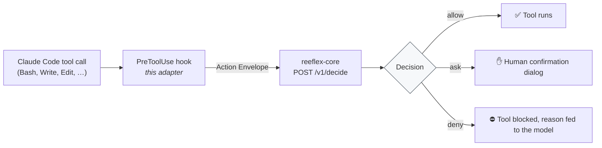

# reeflex-claude

Reference adapter: the Claude Code PreToolUse hook — [Reeflex](https://reeflex.io) governance that **also protects you from your own agent**, gating every tool call on its impact before it runs.

**What it is:** A Reeflex adapter that governs Claude Code tool calls by implementing the
four contract responsibilities (SPEC §6): INTERCEPT → NORMALIZE → ENFORCE → AUDIT.

**What it is NOT:** It does not decide anything.  The decision is made deterministically
by `reeflex-core` (OPA/Rego).  Zero LLM anywhere near the decision path.

## How it works

Claude Code fires a `PreToolUse` hook before every tool call.  This adapter:

1. **INTERCEPT** — receives the tool call JSON on stdin (before execution).
2. **NORMALIZE** — maps the tool call to a signed Action Envelope (SPEC §2):
   verb, three risk axes (reversibility / blast_radius / externality), tier.
3. **ENFORCE** — POSTs the envelope to `reeflex-core /v1/decide`; maps the
   Decision to Claude Code's `permissionDecision` (allow | deny | ask).
4. **AUDIT** — appends one JSONL record per decision to the audit log.

Fail-closed invariant: if core is unreachable for any reason, the hook emits
`deny` and exits 0.  It NEVER exits non-zero (which would make Claude Code
continue the tool anyway — silent allow).


```mermaid
flowchart LR
    T["Claude Code tool call<br/>(Bash, Write, Edit, …)"] --> H["PreToolUse hook<br/><i>this adapter</i>"]
    H -- "Action Envelope" --> C["reeflex-core<br/>POST /v1/decide"]
    C --> D{Decision}
    D -- allow --> R["✅ Tool runs"]
    D -- ask --> A["✋ Human confirmation dialog"]
    D -- deny --> X["⛔ Tool blocked, reason fed to the model"]
    style D fill:#f6f8fa,stroke:#57606a
```

## If your Reeflex portal gave you a line (`connect`)

Skip the three steps below. A Reeflex portal's **Connect an agent** screen
(`/app/onboard`) hands you one line:

```bash
pip install 'reeflex-claude>=0.2.0' && reeflex-claude connect \
  --gate <gate-id> --token <rfx_reg_...> --portal https://app.reeflex.io
```

It exchanges the registration token for that gate's configuration, writes one
agent config, asks your engine one real question, and reports the verdict back
to the portal — then stops. `--agent claude` (default) writes the Claude Code
hook; `--agent opencode` writes an OpenCode plugin; `--agent litellm` writes a
proxy config fragment. **`--dry-run` prints every path it would write and
exits**, exchanging nothing.

Three things worth knowing before you paste it:

- **It does not fetch a document and execute it.** The whole procedure is
  written out in [`docs/setup/v1/agent-setup.md`](../docs/setup/v1/agent-setup.md),
  the portal shows that file in full beside the copy button with its SHA-256,
  and this package pins the same digest. "Fetch a URL and follow whatever it
  says" is the instruction shape Reeflex exists to gate; we do not issue it.
- **The token in the line is not your gate token.** It is scoped to one gate,
  spent by one exchange, and expires in minutes. The exchange returns no
  secret. If your engine needs a bearer token, export `REEFLEX_CORE_TOKEN`
  yourself first — `connect` reads it from the environment, says so when it is
  absent, and never invents one.
- **What the portal then shows is your agent's report.** The `/v1/decide` round
  trip is real; the report of it is not signed evidence. Signed decision
  records come from the evidence connector, which this does not install.

## Install / wire up

**1. Install.** Requires **Python 3.8+** (and a recent pip — upgrade with
`python3 -m pip install --upgrade pip` if the install fails on an old box).

```bash
pip install reeflex-claude
```

**2. Have a reachable core.** Either run `reeflex-core` locally
(`docker compose up -d` from the repo root gives you `http://127.0.0.1:8080`)
or point at an existing deployment.

**3. Wire the hook and verify it, in two commands:**

```bash
reeflex-claude setup   # writes the fail-closed PreToolUse hook into .claude/settings.json
reeflex-claude check   # verifies the deny path: fails closed if core is unreachable
reeflex-claude status  # says WHICH tools reach the gate, and how to widen it if not all
```

> ### Upgrading from any 0.1.x? Run `reeflex-claude setup` again.
>
> **`pip install -U reeflex-claude` rewrites the code and never rewrites
> `settings.json`.** Your hook entry — including its `matcher` — stays exactly
> as the version that wrote it left it, and `pip` says nothing about that.
>
> This matters because **0.1.7 and earlier wrote a matcher that was an
> allowlist of eleven built-in tool names** (`Bash|Write|Edit|MultiEdit|Read|
> Glob|Grep|LS|NotebookEdit|WebFetch|WebSearch`), and Claude Code never
> invokes a hook for a tool the matcher does not select. On such an
> installation every `mcp__*` tool, `Task`, `SlashCommand`, `Skill`,
> `BashOutput` and `KillShell` **reaches no gate at all**: the tool runs, no
> decision is made, no audit record is written and your engine is never asked.
> 0.2.0 fixed the matcher for *new* installations; only re-running `setup`
> fixes an existing one.
>
> From 0.2.1 the hook **records** this rather than running silently: once per
> session it appends one record to the adapter's audit stream under
> `reeflex.adapter/matcher_narrowed`, naming the matcher it is running under,
> the one this version ships, and the command that widens it. It does **not**
> block the call — a narrowing may be deliberate and the hook cannot tell
> deliberate from stale. `reeflex-claude status` reports the same thing on
> demand, and `reeflex-claude status --strict` exits `1` on it, which is the
> command to hang CI on.

`setup` targets the current project's `./.claude/settings.json` by default
(created, with parent directories, if absent); pass `--global` to target
`~/.claude/settings.json` instead. It **merges** — an existing settings file
keeps every unrelated key; only the reeflex-claude `hook` PreToolUse entry
and the `REEFLEX_*` keys in the `env` block are written or updated. A
corrupt existing `settings.json` is left untouched and `setup` exits `1`
with an explanation — it never guesses or overwrites.

Run `setup` in an interactive terminal (TTY) to be prompted for each value
below; in a non-interactive or piped context (CI, scripts, no TTY) it
silently skips the prompts and uses the defaults shown — no error, no hang.

Non-interactive flags (all optional; omitted ones fall back to an
interactive prompt when running in a terminal, otherwise to the default
shown):

| Flag           | Default                  | Meaning                                              |
|----------------|---------------------------|-------------------------------------------------------|
| `--core-url`   | `http://127.0.0.1:8080`   | reeflex-core endpoint                                 |
| `--token`      | none                      | optional bearer token — prefer `REEFLEX_CORE_TOKEN` via env instead; see the warning `setup` prints if you use this flag |
| `--verify-ssl` | `true`                    | `false` only for dev/self-signed endpoints, at your own risk |
| `--mode`       | `enforce` (fail-closed)   | `observe` = fail-open calibration mode (recommended for a first dry run) |
| `--env`        | `production`              | `production` \| `staging` \| `dev`                     |

Expected `reeflex-claude setup` output (abridged):

```
[reeflex-claude] Wrote new PreToolUse hook entry in /path/to/.claude/settings.json
[reeflex-claude]   matcher: *
[reeflex-claude]   command: /path/to/venv/bin/reeflex-claude hook  (timeout 30s)
[reeflex-claude]   env: {"REEFLEX_CORE_URL": "http://127.0.0.1:8080", "REEFLEX_MODE": "enforce", ...}
[reeflex-claude] Mode: ENFORCE (fail-closed) -- the safe default for a governance gate.
[reeflex-claude] Now run: reeflex-claude check
```

Expected `reeflex-claude check` output (PASS):

```
[reeflex-claude] probing hook command: ['/path/to/venv/Scripts/reeflex-claude', 'hook']
======================================================================
PASS -- fail-closed verified
======================================================================
hook denied the probe and exited 0 (fail-closed verified). stdout=...
[reeflex-claude] settings OK: /path/to/.claude/settings.json contains the reeflex-claude PreToolUse hook.
```

### `check` and `status` answer different questions

`check` asks about the **package**: can the command wired into `settings.json`
actually be started, and does the hook fail closed when core is unreachable.

`status` asks about the **installation**: of the tools Claude Code has, which
ones are routed to the hook at all. `check` cannot answer that and does not
try — it reports a narrowing as a WARNING and still prints `PASS`, because a
matcher does not weaken the fail-closed path, it **bypasses** it. Neither
command's verdict is a claim about the other's question.

Expected `reeflex-claude status` output on an installation upgraded from
0.1.x without re-running `setup`:

```
======================================================================
COVERAGE: NARROWED -- some tools reach no gate at all
======================================================================
[reeflex-claude] matcher this version installs: '*'
[reeflex-claude] matcher(s) this installation is wired with:
[reeflex-claude]   'Bash|Write|Edit|MultiEdit|Read|Glob|Grep|LS|NotebookEdit|WebFetch|WebSearch'  (DOES NOT cover every tool)
[reeflex-claude]     from: /path/to/.claude/settings.json
...
[reeflex-claude] Widen it by running, in the same place you ran setup:
[reeflex-claude]   reeflex-claude setup
```

**What `status` cannot see, and says so:** if you launch with `claude
--settings <path>`, the hook is never told which settings file was loaded —
its stdin payload carries the session, cwd and tool call, and its environment
carries `CLAUDE_PROJECT_DIR` and the loaded settings' `env` block, but nothing
names that path. Coverage then reads **UNVERIFIED**, recorded under its own
rule id (`reeflex.adapter/matcher_unverified`) so it is never mistaken for a
measured narrowing — and never for silence. Re-running `setup` writes a
`REEFLEX_CLAUDE_MATCHER` stamp into the settings `env` block, which *does*
travel to the hook and closes that case for the file it was written into.

`check` forces the probe's own `REEFLEX_MODE=enforce` and points it at an
unreachable core address regardless of your real configuration — it is
testing the **adapter's** fail-closed plumbing (installed correctly,
resolvable on `PATH`, denies when core is unreachable), not your policy
configuration (that is core's job, exercised by `demo/run_demo.py` or a real
`/v1/decide` call). Exit code `0` = PASS, `1` = FAIL.

**Why the wired command is an absolute path.** A PreToolUse hook that cannot
start exits non-zero, and Claude Code then runs the tool anyway — a silent
allow, with no audit record and no message on screen. Earlier releases wired
the bare name `reeflex-claude hook`, which only moved that risk from the cwd
to the `PATH`: install into a virtualenv, launch Claude Code from an ordinary
shell, and the hook is `command not found`. `setup` therefore writes the
absolute path of the installed entry point, and `check` verifies the command
that is actually in your `settings.json`.

**Why the matcher is `*`.** Claude Code treats `matcher` as an allowlist: a
tool whose name does not match never reaches the hook at all. Listing tool
names would silently exempt every `mcp__*` tool — a database, payments or
cluster MCP server is exactly where an irreversible production action lives —
along with `Task`, `SlashCommand`, `Skill`, and every tool added to Claude
Code after the list was written. A governance gate cannot be enumerated in
advance; unknown tools are classified conservatively instead (see
`classify.py`). If you deliberately narrow the matcher, `check` will say so.

**4. Restart Claude Code.** From the next tool call on, every action passes
through the gate.

## Development install

For contributors working from a git clone (no pip install), the adapter is
plain Python (stdlib only) and lives in this repository:

```bash
git clone https://github.com/Reeflex-io/reeflex.git
cd reeflex/reeflex-claude
```

Wire it into Claude Code's `settings.json` (a full sample is in
[`examples/settings.sample.json`](examples/settings.sample.json)) using the
**absolute path** to `hook_entry.py` so it works regardless of the working
directory Claude Code runs from:

```json
{
  "hooks": {
    "PreToolUse": [
      {
        "matcher": "*",
        "hooks": [
          {
            "type": "command",
            "command": "python /absolute/path/to/reeflex/reeflex-claude/hook_entry.py",
            "timeout": 30
          }
        ]
      }
    ]
  }
}
```

(`python -m reeflex_claude` also works, but only if Claude Code's working
directory is `reeflex-claude/` — the absolute-path form is the reliable one.)

> ⚠ **A misconfigured hook fails OPEN.** Claude Code only treats a
> PreToolUse hook's exit code **2** as "block". Any other non-zero exit
> (for example, the `No module named reeflex_claude` you get from
> `python -m reeflex_claude` when the working directory is not
> `reeflex-claude/`) is treated as a probe failure, and Claude Code
> **runs the tool anyway** — the gate is silently bypassed. `hook_entry.py`
> is written to always exit `0` and print an explicit `allow`/`deny`/`ask`
> decision, so it fails **closed** instead. After wiring the hook, always
> run the verify command below before trusting it. (This is exactly the
> failure class that the pip-installed `reeflex-claude check` command above
> structurally eliminates — no absolute paths, no cwd-dependent import.)

**Verify the wiring.** Run this once, with the same absolute path you put in
`settings.json` (core does not need to be running — the point of this check
is that a destructive command gets an explicit `deny`, not a crash):

```bash
echo '{"session_id":"verify-1","tool_name":"Bash","tool_input":{"command":"rm -rf /"}}' | python /ABSOLUTE/PATH/TO/reeflex/reeflex-claude/hook_entry.py
```

Expected stdout (one JSON line; the exact wording of the connection error
varies by OS):

```json
{"hookSpecificOutput":{"hookEventName":"PreToolUse","permissionDecision":"deny","permissionDecisionReason":"Reeflex: core unreachable or error -- failing closed: ... [rule=reeflex.core/fail_closed]"}}
```

Then check the exit code — it MUST be `0` even though the decision is
`deny` (that is fail-closed working correctly; a non-zero exit here is
exactly the fail-open bug described above):

```bash
# POSIX (bash/zsh)
echo $?

# Windows (cmd.exe)
echo %ERRORLEVEL%

# Windows (PowerShell)
$LASTEXITCODE
```

If you instead ran the unqualified `python -m reeflex_claude` form from a
directory other than `reeflex-claude/`, this same check will show the
failure mode directly: `No module named reeflex_claude` printed to stderr
and a **non-zero exit** — confirming the fail-open gap this section warns
about.

**Set the environment variables** (below) and restart Claude Code, or run
`reeflex-claude setup` from within the git clone (it works the same way —
`pip install -e .` first, or run it via `python -m reeflex_claude.cli setup`).

## Environment variables

| Variable                    | Default                             | Purpose                                     |
|-----------------------------|-------------------------------------|---------------------------------------------|
| `REEFLEX_CORE_URL`          | `http://127.0.0.1:8080`             | reeflex-core endpoint                        |
| `REEFLEX_CLAUDE_ENVIRONMENT`| `production`                        | target environment (production\|staging\|dev)|
| `REEFLEX_CLAUDE_STRICT`     | unset                               | if set truthy: unknown execute → irreversible **and broad**, so an unrecognised command in production reaches a human. Before RFX-145 it lifted only reversibility, and R2 requires `broad`, so it could not change any verdict — it changed a word in the audit log. |
| `REEFLEX_CLAUDE_PRINCIPAL`  | null                                | on_behalf_of value in the envelope           |
| `REEFLEX_CLAUDE_AUDIT_LOG`  | `<tempdir>/reeflex-claude-audit.jsonl`| adapter-side audit log path                |
| `REEFLEX_CLAUDE_STATE_DIR`  | `<dir of the audit log>/.reeflex-claude-sessions` | where the once-per-session markers live that keep the coverage check off the hot path. After the first tool call of a session the check costs one `stat`. Wiping this directory makes the next call re-check and, if coverage is narrowed, re-record it. |
| `REEFLEX_CLAUDE_MATCHER`    | written by `setup` (0.2.1+)         | the matcher `setup` wired, stamped where the hook can read it. **Only** consulted when no settings file at a fixed location names the hook — a `claude --settings <path>` launch. A settings file always wins over it, because the file is what governs now and a stamp is what `setup` wrote then. |
| `REEFLEX_CLAUDE_TIMEOUT`    | `5`                                 | HTTP timeout to core in seconds              |
| `REEFLEX_CLAUDE_TIMEOUT`    | `5`                                 | HTTP timeout to core in seconds. **An upper request, not a grant:** it is clamped under the hook deadline below, so raising it buys only what is left of the budget. Before RFX-321 a value above the hook entry's timeout inverted the gate to fail-**open** — see "The gate is no more fail-closed than the hook runner". |
| `REEFLEX_CLAUDE_HOOK_TIMEOUT`| `30` (written by `setup`)          | What the hook believes the PreToolUse runner's timeout is, i.e. when it will be killed. **Read for LOWERING only** — `min(value, 30)`. A number a customer can set *above* the runner's real timeout is the RFX-321 defect, not a fix for it. `setup` writes this and the hook entry's own `timeout` from one value; `check` warns when they have drifted apart. |
| `REEFLEX_CLAUDE_MAX_COMMAND_CHARS`| `65536`                       | Longest Bash command the classifier will tokenize. Past it the command is **not parsed** and the action is refused under `adapter/command_too_large`. **Lowerable, not raisable**, for the same reason as the hook timeout. |
| `REEFLEX_VERIFY_SSL`        | `true` (full TLS verification)     | set to `0`/`false`/`no`/`off` (case-insensitive) to **disable** TLS certificate verification on the call to core. Insecure — dev/self-signed endpoints only, at the operator's own risk. Same env name as the WordPress adapter. |
| `REEFLEX_CORE_TOKEN`        | unset                               | optional bearer token; when set, adds `Authorization: Bearer <token>` to the `/v1/decide` request. Never logged. Same env name as the WordPress adapter. |
| `REEFLEX_PORTAL_URL`        | unset                               | **not a secret.** Where the confirmation dialog tells the reader an open hold is being decided (RFX-318). Usually unnecessary: `connect` records the portal beside the credential and that is used automatically. With neither, the dialog names the **engine** URL — a portal is never guessed, because an operator on a self-hosted engine has no `app.reeflex.io`. |

Setting `REEFLEX_CLAUDE_ENVIRONMENT=dev` or `staging` relaxes the base policy
(R2/R3/R6 are production-scoped), letting dev workflows through without approvals.

`reeflex-claude setup` writes these into your Claude Code `settings.json`
`env` block for you (see "Install / wire up" above); the table is the
reference for what each variable does and for the git-clone / manual-export
path.

### Trying it against api-dev.reeflex.io

`https://api-dev.reeflex.io` is a public evaluation endpoint. Use the public
eval token below — no signup needed:

> **Eval token:** `reeflex-eval-public-2026` — dev endpoint, rate-limited,
> **may reset anytime; not for production.**

```bash
reeflex-claude setup --core-url https://api-dev.reeflex.io \
  --token reeflex-eval-public-2026 --mode observe
reeflex-claude check
```

TLS verification stays on (`--verify-ssl` defaults to `true`) — no flag is
needed here: `api-dev.reeflex.io` carries a valid, publicly-trusted
certificate. Starting with `--mode observe` lets you watch decisions land in
the audit log without the adapter enforcing them, so a policy
misconfiguration or connectivity issue can't block your Claude Code session.
Note that `reeflex-claude check` always probes with an intentionally
unreachable core address regardless of `--core-url` — it verifies the
adapter's fail-closed plumbing, not connectivity to api-dev itself; use the
demo or a manual `curl .../v1/decide` to confirm the endpoint responds.

For the git-clone / manual-export path, the equivalent is:

```bash
export REEFLEX_CORE_URL=https://api-dev.reeflex.io
export REEFLEX_CORE_TOKEN=reeflex-eval-public-2026   # public eval token (may reset anytime)
export REEFLEX_MODE=observe                 # recommended for a first run — see below
```

## Decision mapping

| core decision      | permissionDecision | effect                                     |
|--------------------|--------------------|--------------------------------------------|
| `allow`            | `allow`            | tool runs                                  |
| `deny`             | `deny`             | tool blocked; reason fed to model          |
| `require_approval` | `ask`              | human confirmation dialog shown            |
| core unreachable   | `deny`             | fail-closed; reason explains the error     |

## Running the demo

```bash
set REEFLEX_OPA_BIN=C:\path\to\opa.exe
python reeflex-claude/demo/run_demo.py
```

Runs 7 scenarios (ls → allow, rm -rf / → deny, force push → ask,
fragmentation → ask at budget, fail-closed → deny exit 0).

## Running the tests

```bash
cd reeflex-claude
python -m unittest discover -s tests -v
```

No network required for unit tests (classify + envelope are pure; enforce
tests spin a local stub server). `test_setup_settings.py` and `test_cli.py`
cover `setup`'s merge semantics (fresh write, merge-preserving, corrupt-JSON
refusal) and `check`'s deny-scenario probe (healthy install, missing binary,
non-zero exit, malformed output, wrong decision) without touching your real
`~/.claude` or `./.claude` directories.

`test_conformance_bash.py` runs the corpus in `reeflex_claude/conformance.py`
— commands whose real-world effect was written down before the classifier was
— through the classifier and an offline transcription of the policy pack
(`tests/policy_oracle.py`), and fails if any irreversible production
destruction reaches `allow`, or if any everyday command stops reaching it. The
**live** equivalent of the same corpus, through the real hook against a real
core, is:

```bash
REEFLEX_PROBE_BASE=http://127.0.0.1:8099 \
  python3 scripts/attack-probe-rfx144-agent-prices-own-action.py --strict --budget
```

`REEFLEX_PROBE_BASE` is required and the hosted hostnames are refused: this
harness replays ground-truth production destructions, so it must only ever be
pointed at a core built for the run.

Its exit code is the number of ground-truth production destructions that were
allowed with no human, **plus the number of cases where the live core and the
offline oracle disagreed** — both planes score the same corpus against the same
oracle, and a disagreement means one of them is wrong about the shipped pack.
`gate.py` runs it as the `claude-corpus-live` component against the core it
already starts (RFX-303); before that ticket nothing ran it at all, and the two
planes had drifted apart in two places. Known residuals are printed with the
ticket that tracks them and excluded from the count — a bounded gate that says
what it does not cover is honest; one that silently drops cases from its own
total reads as "covered everything".

## Limits / upgrade paths

### The gate is no more fail-closed than the hook runner (measured)

Everything below, and every fail-closed sentence in this README, is conditional
on one thing this adapter does not own: **what Claude Code does with a
PreToolUse hook that fails to answer cleanly.** It was assumed for a long time
and measured for the first time by round `qa--221` on **`claude` 2.1.268**,
against the published `reeflex-claude` 0.2.0 wheel. The observable was whether
`rm -rf <fixture>` actually ran, with a healthy-allow and a healthy-deny control
in the same run.

| what the hook did | did the tool run? |
|---|---|
| well-formed JSON `deny` (exact lowercase), exit 0 | **no** — blocked |
| exit code 2 (the documented blocking path) | **no** — blocked |
| raised, exit 1 with a traceback | **yes** |
| wrote non-JSON on stdout, exit 0 | **yes** |
| wrote nothing, exit 0 | **yes** |
| ran longer than the entry's `timeout` (killed) | **yes** |
| `"Deny"` / `"DENY"` — one capitalised letter | **yes** |
| `command` in settings.json does not exist | **yes** (hook never runs) |

Read the right-hand column as the contract: **a hook that dies, stalls, crashes
or mis-spells its verdict is not blocking anything.** A late `deny` is not a
deny at all — the runner has already moved on. This is Claude Code's behaviour,
not something the adapter chose, and it may differ on another version; re-measure
before relying on it. `RFX-323` tracks it.

Two customer-reachable conditions used to break that precondition, and both put
`rm -rf` through with no human (RFX-321 / RFX-322):

- **`REEFLEX_CLAUDE_TIMEOUT` set above the hook entry's timeout.** Two numbers
  in two places with nothing comparing them; `45` is what an operator with a
  slow engine reaches for. The socket waited 45 s, the runner killed the hook at
  30 s, and the tool ran.
- **A Bash command large enough that `classify()` alone overran the timeout**
  (~700 KB and up — the cost is `shlex` tokenisation and is super-linear in
  command length). Same ending.

**What the adapter does about it now.** `deadline.py` starts a clock at import
and arms a watchdog in `hook.main()`. At 80 % of the runner's timeout (24 s of
the shipped 30 s) it writes a real verdict — `deny` in enforce mode, `allow` in
observe, which must never block — and terminates the process, *before* the
runner can kill it, whatever the socket or the classifier is still doing. The
socket timeout is clamped under what is left of that budget, and `classify()`
refuses to tokenize past `REEFLEX_CLAUDE_MAX_COMMAND_CHARS`. Every stdout write
in `hook.py` goes through one `_emit_once()`, so the watchdog and the pipeline
cannot both answer — two JSON lines is the "garbage on stdout" row above.

**What that costs, said here rather than discovered later.** An operator who
raises the hook entry's `timeout` to 60 s because their engine is genuinely slow
does **not** get a 60 s budget: the deadline is derived from the built-in 30 s,
and they will see a `deny` at ~24 s whose reason says so. Raising the ceiling
takes a release, not an env var — the direction is deliberate, because a noisy
deny is recoverable and a late one is the fail-open this exists to close.

**What this does not close.** Nothing here helps when the hook never *starts*
(a missing command or a broken `PATH` — RFX-205, the last row of the table) or
when the event never reaches the hook (the matcher — RFX-204/206). Those are a
different layer with their own tickets. This is about a hook that did start and
has to finish in time.

- **Bash classification** is heuristic — structural matching on each command
  of the line, not a shell AST.  Since RFX-144 the whole line is classified
  and not its first token: it is split at `&&`, `||`, `;`, `|`, `&` and
  newline (quote-aware), `sh -c '<inner>'` is expanded in place,
  `sudo`/`env`/`timeout`/`nohup`/`xargs` are peeled off, every resulting
  command is classified on its own, and the most dangerous one is reported.
  A line is a `read` only when every command on it is a read.
  **Known gaps today**, none of them closed by this design: a command inside
  a script file (`python3 deploy.py`, `bash deploy.sh`) is opaque, and a
  destruction executed on another host (`ssh prod rm -rf /srv/data`) is
  priced as the outbound `emit` it is rather than the delete it causes.
  UPGRADE: a real shell-AST parser once tooling stabilises.
- **A single named production file: covered two ways now, and the two do not
  cover the same set (RFX-153).**  `blast_radius` is a *cardinality* axis, so
  R2's `broad` requirement never reached `rm /srv/prod/db.sqlite` — one
  production database, gone.
  **Adapter side:** a path whose name says it is a *container of records*
  (`.sqlite`, `.db`, `.sql`, `.dump`, `.tar*`, `/pgdata/`, `/mysql/` …) is now
  raised to `broad`, and a block device (`/dev/sdb`, excluding `/dev/null` and
  friends) to `systemic`.  This is a **KIND** claim, which SPEC §4.2 permits a
  name to make, and it is **raise-only** — the cardinality is still 1, and it
  can never make an enumerated set smaller or lower a `systemic` reading.  So
  `rm /srv/prod/db.sqlite` reaches a human while `rm /tmp/scratch.txt` and
  `rm /srv/app/notes.txt` still allow.
  **What the adapter side does NOT cover:** a production file whose *name*
  carries no container signal — `/home/app/data/store`, `/srv/prod/state`.
  The adapter cannot price those `broad` without claiming a cardinality it
  cannot observe.
  **Policy side:** R6 (SPEC §4.3) closes that remainder — it holds an
  irreversible production action on a *declared production asset* at any
  cardinality, by ref rather than by name shape.
  **Read this before assuming you are covered:** the list shipped in
  `reeflex-core/policy/protected.rego` is a floor derived from the Filesystem
  Hierarchy Standard (`/srv`, `/var/lib`, `/var/opt`, ...).  It knows nothing
  about `/home/app/data`, an unconventional database directory, or your bucket
  names.  UPGRADE: add your paths to `protected_assets`, or set
  `default_protected := true` to hold every irreversible production action
  whose ref is not declared ephemeral.
- **Two destruction shapes needed BOTH halves of this change (RFX-153 +
  RFX-144, measured).**  `> /srv/prod/db.sqlite` and
  `dd if=/dev/zero of=/srv/prod/db.sqlite` used to be classified `execute` +
  `recoverable`, and R6 requires `irreversible` — so while the policy pack
  alone was in place, **no policy posture rescued them**: a policy rule cannot
  correct an envelope that under-declares irreversibility.  Both are now
  `delete` + `irreversible` + `broad`.  Measured through the shipped policy
  pack, same envelope both ways:

  | adapter axes | decision |
  |---|---|
  | `execute` + `recoverable` (before RFX-144) | `allow` / `reeflex.policy/default_allow` |
  | `delete` + `irreversible` (after RFX-144) | `require_approval` / `reeflex.policy/irreversible_protected_asset_prod` |

  Stated this way on purpose: **neither change closed this on its own**, and
  each was green in its own test suite for the whole time the gap was open.
  If only one of the two is present in your build, treat redirection and `dd`
  as ungoverned.
- **Stub signing**: `meta.signature = "ed25519:stub:..."`.  UPGRADE: Vault-backed
  ed25519 signing once the key management path is implemented (SPEC §6 note).
- **Four families the classifier cannot see at all** (RFX-158): the program
  arrives on stdin (`curl … | sh`), the program is in a file (`bash deploy.sh`,
  `python3 deploy.py`), the command word is expanded by the shell
  (`$RM -rf …`, `$(echo rm) …`), or the destruction runs on another host
  (`ssh prod 'rm -rf /srv/data'`, priced as the outbound `emit` it is).  The
  destruction is not in the command string, so **this** classifier does not
  price it — and for the first three it is not in the command string at all,
  so nothing that reads only that string would.  The `ssh` case is different
  and should not be lumped in: the remote command *is* on the line, and a
  classifier that parses `ssh`'s argv can price it (PR #98 did, measured), so
  that one is unclosed work rather than a limit of the approach.

  **One of the four is now refused rather than read.** When the command word
  is a *command substitution* — `$(echo rm) -rf …`, `` `which rm` -rf … ``,
  `eval "$(curl …)"` — the adapter no longer guesses: it coerces every axis it
  cannot know to that axis's most-guarded member (SPEC §4.0) and core denies
  the action in production.  Two bounds on that sentence, both measured:
  it is **production only** (R2/R3/R6/R7 are each conjoined with
  `target.environment == "production"`, so in `staging` and `dev` these lines
  are still allowed — as is `rm -rf /` typed directly), and it does **not**
  cover the `$RM` parameter-expansion spelling, which reaches the same
  destructions and is left alone because it is 11.5% of real shell command
  lines against command substitution's 0.83%.  Cost of the part that shipped:
  **472 of 57,027** command lines in this box's own shell scripts, and 0 of
  the corpus's 68 agent-shaped rows.
  **`REEFLEX_CLAUDE_STRICT=1` covers 4 of the 8 `gap-` rows** —
  measured, not asserted: they are all unrecognised *execute* commands, which
  strict mode prices `irreversible`+`broad`.  Of the other four, **3 are
  already refused without the knob** (the command-substitution rows, above)
  and **1 is out of its reach** — the `ssh` case, which is classified `emit`
  rather than unrecognised, so the lever misses it and an operator should know
  that.  These four numbers are recomputed from the corpus by
  `test_readme_strict_numbers_are_recomputed_from_the_corpus`, so they cannot
  drift away from the code again the way `five of the six` did.
- **REEFLEX_CLAUDE_STRICT**: unset by default so coding agents are not blocked on
  every `npm install`.  When set, every UNRECOGNISED command is priced
  irreversible + broad, so in production it reaches a human — measured live on
  the conformance corpus, **it moves 66 of the 252 conformance cases**, every
  one of them `allow` → `ask` and **none of them to `deny`** — so the knob
  raises work to a human and does not by itself stop anything.  **58 of those
  66 are `everyday-` rows** — ordinary developer work such as `pytest`,
  `npm install` and `make build` — and 4 are the RFX-158 gap rows above.  That
  proportion is the price of the knob and is stated here rather than left to be
  discovered: it is the noisy setting, and today it is the broadest lever this
  adapter ships for the commands the classifier cannot read.  It is not the
  only way to cover them: a policy-side rule, or parsing the wrapper the
  destruction hides behind, both reach cases strict mode does not (the `ssh`
  family above is one).  Before RFX-145 it was neither noisy nor safe — it
  moved **zero verdicts in the tightening direction** and only changed a word
  in the audit log.  All four numbers in this paragraph are recomputed from the
  corpus by `test_readme_strict_numbers_are_recomputed_from_the_corpus`; the
  `23 of 82` they replace was true when RFX-145 landed and had been false for
  two corpus growths before anyone read it off the shipped wheel.
  UPGRADE: use a per-command allow-list in policy instead.
- **approval re-submission**: the hook sets `approval.present = false` at
  interception.  Re-submission with `approval.present = true` after human
  approval is the caller's responsibility (Claude Code surfaces the `ask` dialog;
  the human clicks allow; Claude Code retries the tool — the adapter then
  re-intercepts with the same payload, at which point the policy must be
  configured to allow with approval present).

## Observe mode

Observe mode is a dry-run / monitoring mode. Set `REEFLEX_MODE=observe` in the
hook's environment and the adapter will **always emit `allow`** — Claude Code
proceeds with the tool call — while still writing an audit record annotated with
`"mode": "observe"` and the would-be verdict from core.

```bash
export REEFLEX_MODE=observe
```

**Fail-OPEN rule:** in observe mode any error (core unreachable, timeout, invalid
response) also results in `allow` — it never blocks. This is the opposite of
enforce mode's fail-closed invariant, and it is intentional: observe must never
interrupt a Claude Code session.

Use observe mode for dry-run calibration before enabling enforcement: run your
normal Claude Code workflows, inspect the JSONL audit log for `deny` and
`require_approval` records, tune policy as needed, then remove `REEFLEX_MODE` (or
set it to `enforce`) to activate full fail-closed enforcement.
