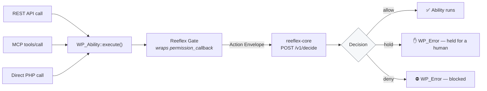

# reeflex-wordpress

The **reference WordPress adapter** for Reeflex. Its job is to intercept
every WordPress Abilities API action before it executes, normalize the
operation into the universal **Action Envelope** (SPEC §2), ask
`reeflex-core POST /v1/decide`, and enforce the decision: allow the action,
block it with a `WP_Error`, or hold it for human approval. Every decision is
deterministic — OPA/Rego evaluated in `reeflex-core`, zero LLM in the
decision path.

> **Open-core boundary.** This adapter (like `reeflex-core` and
> `reeflex-spec`) is Apache 2.0 / open source. The planned commercial
> compliance tier (NIS2/DORA/GDPR reporting, ANAF/SmartBill integrations)
> is a separate, closed package and will never be present in this repository.

---

## "I already set permissions in the Abilities API — why add Reeflex?"

Because they answer two different questions.

WordPress gives every ability a `permission_callback`. It answers **"is this
user allowed to do this?"** — a capability check tied to identity and role. If
an agent authenticates as an editor, `current_user_can( 'delete_posts' )` is
`true`, and the ability runs. It will return `true` for deleting *one* post and
equally `true` for deleting *five thousand* — capability does not look at scale,
scope, or reversibility.

Reeflex answers a different question: **"is this action safe, given the impact
it would actually have?"** It runs *after* the permission check passes and
looks at the action itself — how many items, force-delete vs. trash, site-wide
vs. single, and everything already done this session — then returns allow, hold,
or deny on that computed impact.

A concrete case: an authenticated agent asks to bulk-delete every product in
your store. `permission_callback` says yes (the agent has the capability).
Reeflex says **hold** — irreversible, broad, in production — and waits for a
human. The permission was never the problem; the *magnitude* was.

Think of `permission_callback` as the access badge that opens the server-room
door, and Reeflex as the check that stops you walking in with a bulldozer —
even with a valid badge. On a WordPress 6.9+/7.0 site exposing abilities to AI
agents (via REST or the MCP Adapter), that second check is exactly what the
Abilities API does not give you on its own.

---

## WordPress, MCP, and where Reeflex fits

WordPress is becoming AI-native, deliberately and fast. **WordPress 6.9** put
the Abilities API in core — a standardized registry of what a site can do.
The official **MCP Adapter** plugin exposes those abilities to AI agents over
the Model Context Protocol, so tools like Claude, Cursor, and VS Code can
discover and execute site functionality directly. **WordPress 7.0** deepens
this with a JavaScript abilities layer and a native AI client in core. This is
the direction of travel: agents managing content, orders, and configuration as
a normal way of running a site.

We think that future is genuinely exciting — and it needs a safety layer that
doesn't exist yet. The Abilities API checks *permission*; MCP handles
*transport*; neither looks at *impact*. Reeflex is not a competitor to any of
this — it's the missing piece that makes the rest safe to adopt: a deterministic
gate at the same seam all these paths already pass through
(`WP_Ability::execute()`), deciding on computed impact before anything
irreversible happens, and writing an audit record either way.

In short: **WordPress built the door for AI agents. The MCP Adapter opens it to
the world. Reeflex is the guard at that door** — so you can open it with
confidence instead of crossed fingers.

---

## How interception works (both delivery forms)

Every path an agent can take into WordPress converges on the same seam — and
that seam is where the gate sits:



### Seam 1 — the Abilities API hook (primary)

Both delivery forms (standard plugin and mu-plugin, below) register the same
two hooks:

- **Hook A** — `wp_register_ability_args` (filter, WordPress Abilities API).
  This is the **primary blocking seam**. It wraps every registered ability's
  `permission_callback` so that Reeflex gates the action before
  `WP_Ability::execute()` can reach `do_execute()`. Because all paths
  through WordPress — REST API, direct PHP call, and MCP-originated
  `tools/call` — terminate at `WP_Ability::execute()`, Hook A governs all of
  them with a single intercept point.

- **Hook B** — `mcp_adapter_pre_tool_call` (filter, MCP Adapter plugin).
  Defense-in-depth for the MCP tool layer. Fires only for the
  `mcp-adapter/execute-ability` tool and adds MCP-layer fidelity (reads the
  `Mcp-Session-Id` header for session tracking). A `WP_Error` return
  short-circuits `ToolsHandler::call_tool()`. MCP-originated calls activate
  both hooks independently — that double-gate is intentional.

### Seam 2 — external MCP proxy (defense-in-depth / when WP is not modifiable)

Reeflex sits **between** the AI agent and the WordPress MCP endpoint. The
proxy intercepts `tools/call` JSON-RPC requests, normalizes them into an
Action Envelope, and forwards or drops them based on the core decision.

- Transport: JSON-RPC 2.0 over Streamable HTTP.
- WordPress MCP endpoint: `POST /wp-json/mcp/{namespace}/{route}`
  (default namespace: `mcp-adapter-default-server`).
- The tool name for ability execution: `mcp-adapter/execute-ability`.
- Auth: WordPress Application Passwords; the `Mcp-Session-Id` header from
  the `initialize` handshake must be relayed on every subsequent request.
- On **allow**: the proxy forwards the original request unchanged.
- On **deny** or **require_approval**: the proxy drops the request and
  returns a JSON-RPC error object without reaching WordPress.
- On **core unreachable**: fail closed — drop the request.

**Use this method** when the WordPress install cannot be modified (no
mu-plugins access) or as a network-boundary complement to the in-WP gate.
Note: since Hook A already covers MCP-originated calls, the proxy adds a
network-layer block independently of the in-WP hook.

---

## Installing the adapter — two delivery forms

Reeflex ships the WordPress adapter in two forms. Pick the one that matches how
much filesystem access you have and how strict you need to be. **Both enforce
the exact same decisions** — the difference is only how they are installed and
configured.

### Option A — Standard plugin (recommended, installs from the UI)

The zero-friction path. No filesystem access, no code, no wp-config edits.

1. Download `reeflex-gate-wordpress-standard.zip` from the
   [latest release](https://github.com/Reeflex-io/reeflex/releases).
2. In wp-admin: **Plugins → Add New → Upload Plugin** → choose the zip →
   **Install Now** → **Activate**.
3. Go to **Settings → Reeflex Gate** and fill in:
   - **API URL** *(required)* — your `reeflex-core` endpoint. Use
     `https://api-dev.reeflex.io` to try it against our public dev endpoint,
     or your own deployment URL in production.
   - **Token** *(optional)* — the bearer token, if your core has auth enabled.
   - **Verify TLS certificate** *(default: on)* — leave **on** for any real
     deployment. Turn it **off only** when pointing at `api-dev.reeflex.io`
     (see the note below).
4. Done. The gate is now intercepting every ability call.

This is the right choice for most sites, and the only choice when you cannot
reach the filesystem (managed hosting, no SFTP).

### Option B — mu-plugin (must-use, for hardened installs)

For operators who want the gate to load before everything else and be
impossible to disable from wp-admin. Requires filesystem access.

1. Download `reeflex-gate-wordpress-mu.zip` from the
   [latest release](https://github.com/Reeflex-io/reeflex/releases).
2. Unzip it and upload the contents — `reeflex-gate.php` **and** the
   `reeflex-gate/` folder — into `wp-content/mu-plugins/` via SFTP, SSH, or
   your host's file manager. (Create `mu-plugins/` if it doesn't exist.)
3. Configure via constants in `wp-config.php` (a must-use plugin has no
   Settings screen):

   ```php
   define( 'REEFLEX_CORE_URL', 'https://api-dev.reeflex.io' );
   define( 'REEFLEX_CORE_TOKEN', '' );        // optional
   define( 'REEFLEX_VERIFY_SSL', false );     // only for api-dev; true in prod
   ```

4. Done. Must-use plugins activate automatically — nothing to click.

> **Precedence:** a `wp-config.php` constant always wins over the Settings
> screen, and the corresponding UI field shows as locked. This lets you pin
> configuration in code even when using the standard plugin.

### About `api-dev.reeflex.io` (public development endpoint)

We run `api-dev.reeflex.io` so anyone can try Reeflex end-to-end without
deploying core first. Two things to know, stated plainly:

- **It is a development/test endpoint.** It carries a Let's Encrypt **staging**
  certificate, which is not trusted by browsers or HTTP clients by design. It
  is **not suitable for production** and may reset or change at any time.
- **Because of that staging certificate, you must set `verify_ssl = false`**
  (standard plugin: uncheck *Verify TLS certificate*; mu-plugin:
  `define( 'REEFLEX_VERIFY_SSL', false );`) for the adapter to connect to it.

This is a conscious, dev-only trade-off — an open, frictionless way to test.
**For production, or any internal deployment, use a real endpoint with a valid
certificate and keep `verify_ssl = true`.** Disabling certificate verification
against anything other than this dev endpoint defeats the transport security
the gate relies on.

### Verify the install

Trigger any registered ability (e.g. a REST call that exercises a delete
ability) and confirm a destructive action is held or denied. Check
`wp-content/reeflex-audit.jsonl` for the decision record — or run the
[`reeflex-verify`](../reeflex-verify/) CLI tool for a full scripted check.

Full step-by-step install for both forms: [INSTALL.md](INSTALL.md).

---

## Configuration

### Settings page (standard plugin install)

When installed as a standard plugin, **Settings > Reeflex Gate** provides a
three-field admin page:

- **API URL** — the base URL of your reeflex-core instance. Mandatory; without
  it Reeflex fails closed on every action.
- **Token** — the bearer token for the Authorization header. Optional.
- **Verify TLS certificate** — verify the core's TLS certificate. On by default;
  uncheck only for dev/staging endpoints with untrusted certs (e.g. `api-dev.reeflex.io`).

Settings are stored in `wp_options` under the option `reeflex_gate_options`.

### wp-config.php constants

Constants defined in `wp-config.php` always take precedence over the Settings
page values and lock those fields read-only. Use constants for production
deployments where you need a server-side trust anchor an admin cannot override.
The mu-plugin is configured exclusively through constants.

No secrets are accepted inline — reference them via environment or Vault.

| Constant             | Required     | Default                                    | Description |
|----------------------|--------------|--------------------------------------------|-------------|
| `REEFLEX_CORE_URL`   | **Yes**      | `''` (fail-closed until set)              | Base URL of `reeflex-core`. Must be `https://` in production. `http://` is accepted only for loopback hosts (`127.0.0.1`, `localhost`, `::1`); any other `http://` URL is rejected unconditionally and every call fails closed. No filter override is possible (the URL is a trust anchor; a later-loading plugin cannot redirect decisions). Standard-plugin equivalent: the "API URL" field in Settings. |
| `REEFLEX_CORE_TOKEN` | No           | `''`                                       | Bearer token sent to `reeflex-core` when its auth is enabled. Standard-plugin equivalent: the "Token" field in Settings. Keep it out of version control — reference from environment or Vault. |
| `REEFLEX_VERIFY_SSL` | No           | `true`                                     | Whether to verify the TLS certificate of the core endpoint. **Keep `true` in production.** Set `false` only for development endpoints with untrusted certificates (e.g. `api-dev.reeflex.io`, which uses a Let's Encrypt staging cert). Standard-plugin equivalent: the "Verify TLS certificate" checkbox in Settings. |
| `REEFLEX_ENV`        | No           | `production`                               | Environment label written into every envelope's `target.environment`. Values: `production`, `staging`, `dev`. |
| `REEFLEX_AGENT_ID`   | No           | `agent:wordpress`                          | Agent identity string for `agent.id` in the envelope. |
| `REEFLEX_AUDIT_LOG`  | No           | `WP_CONTENT_DIR/reeflex-audit.jsonl`      | Absolute filesystem path for the append-only JSONL audit log. The default is outside `uploads/` so the file is not web-accessible. Paths containing `..` are rejected; a path inside `uploads/` generates a warning. |
| `REEFLEX_TIMEOUT`    | No           | `5`                                        | HTTP timeout in seconds for `POST /v1/decide`. Short is correct — the fail-closed path fires on timeout; a long timeout only delays the deny. |

`REEFLEX_CORE_URL` has no built-in default remote host. If neither the constant
nor the Settings page value is set, every decision fails closed immediately.
Set it explicitly — via the Settings page for a standard plugin install, or via
the constant for a mu-plugin install or any production deployment.

---

## How enforcement behaves

The adapter produces one of four outcomes for every ability execution
attempt:

| Core decision        | HTTP status | `WP_Error` code       | Meaning |
|----------------------|-------------|------------------------|---------|
| `allow`              | —           | —                      | Ability runs normally. |
| `deny`               | 403         | `reeflex_denied`       | A policy rule fired. Action is blocked. |
| `require_approval`   | 202         | `reeflex_hold`         | Action is held for human approval. **Terminal in v0.1** — the re-submission flow is not yet implemented (see roadmap below). |
| Core unreachable / error | 503     | `reeflex_unavailable`  | Infrastructure failure. **Fail closed** — action is denied. This also fires when `REEFLEX_CORE_URL` is unset, when a non-200 HTTP status is returned by core, when the response is not valid JSON, or when the `decision` field is missing. |

Public-facing error messages are intentionally generic. Internal detail
(the rule that fired, the transport failure reason) is written to PHP
`error_log` and to the JSONL audit record, not surfaced to the calling
agent.

### Obligations

When core returns `allow` with obligations, the adapter:

- Fires `do_action('reeflex_obligation', $obligation, $envelope, $decision)` for each obligation, so operators can hook custom handlers.
- Acknowledges `audit:full` (the audit record is already written before enforcement).
- Logs a warning for any obligation it does not recognize, so nothing passes silently.

---

## Status

**Proven:**
- Adapter code (all five classes in `reeflex-gate/`) is written and code-reviewed.
- **Validated live, end-to-end, on a real WordPress install**: the standard
  plugin installed from the release zip, configured through the Settings page
  against a live `reeflex-core`, with real actions fired via the
  [`reeflex-verify`](../reeflex-verify/) tool — all five scenarios decided as
  expected (read → allow, single delete → allow, bulk force-delete → hold,
  ≥20-item delete → hold, site-wide delete → deny) and enforced in WordPress.
- Offline conformance harness (`tests/conformance-demo.php`) runs the real
  adapter classes against a live `reeflex-core` with WordPress stubbed. All
  seven scenarios pass. Fail-closed behaviour against a dead port is verified.
  See [DEMO.md](DEMO.md) for the full output.

**v0.1 roadmap items (not yet implemented):**
- `meta.signature` in the Action Envelope is a stub (`ed25519:stub:...`).
  Full ed25519 signing is pending Vault-backed key management (SPEC §6).
- The human-approval re-submission flow is not implemented. `require_approval`
  decisions are terminal: the action is held and an operator must act manually.
- Audit record cryptographic signing is likewise pending the Vault signing path.
- `trajectory_ref` is emitted as `null`; richer sequence/drift analysis is roadmap.

---

## References

- [SPEC.md](../reeflex-spec/SPEC.md) — Action Envelope, Adapter Contract, conformance requirements.
- [INSTALL.md](INSTALL.md) — full installation instructions for both methods.
- [DEMO.md](DEMO.md) — reproducible demo: offline conformance table + in-WordPress walkthrough.
- [tests/README.md](tests/README.md) — test harness documentation.
- [tests/conformance-demo.php](tests/conformance-demo.php) — the conformance harness itself.

---

*Reeflex — a seatbelt for the AI acting on your systems.*
